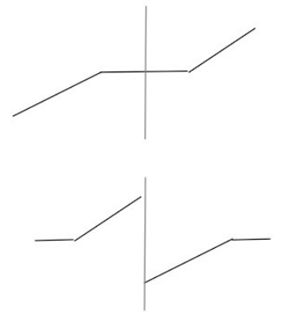
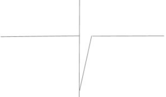

# 剑指offer题解心得

## 数组

### 1. 二维数组中的查找

**题目描述**

一个二维数组中（每个一维数组的长度相同），每一行都按照从左到右递增的顺序排序，每一列都按照从上到下递增的顺序排序。请完成一个函数，输入这样的一个二维数组和一个整数，判断数组中是否含有该整数。

**题解**

1. 可以对每一行进行二分查找
2. 从左下角开始（）向上向右遍历

**心得**

**答案**

```java
boolean fine2(int target, int[][] array){
        int rowCount = array.length;
        int columnCount = array[0].length;

        for(int i=rowCount-1 ,j =0; i < rowCount && j < columnCount;){
            if(target == array[i][j]){
                return true;
            }
            else if(target > array[i][j]){
                j++;
                continue;
            }
            else if(target < array[i][j]){
                i--;
                continue;
            }
        }
        return false;
    }
```


### 2. 数组中重复的数字

**题目描述**

在一个长度为n的数组里的所有数字都在0到n-1的范围内。 数组中某些数字是重复的，但不知道有几个数字是重复的。也不知道每个数字重复几次。请找出数组中任意一个重复的数字。 例如，如果输入长度为7的数组{2,3,1,0,2,5,3}，那么对应的输出是第一个重复的数字2。

**题解**

**心得**

二分查找中对于寻找第一个相同的数字解法：先排序，然后二分查找

**答案**

```java
/**
 * 归位思想
 * 一个萝卜一个坑,如果存在重复,那么自己原来的位置就迟早会被自己占据
 * 边查重边排序
 */
public boolean duplicate3(int numbers[], int length, int[] duplication) {
    if (length <= 0 || numbers == null) {
        return false;
    }

    int index = 0;
    
    while (index < length) {
        if (numbers[index] == index) { // 当前下标index的值刚好为index
            index++;
        } else {
            int tmp = numbers[index];
            if (tmp == numbers[tmp]) { // 要交换位置的两个数相同
                duplication[0] = tmp;
                return true;
            } else { // 交换位置
                numbers[index] = numbers[tmp];
                numbers[tmp] = tmp;
            }
        }
    }
    return false;
}
```


### 3. 构建乘积数组

**题目描述**

给定一个数组A[0,1,...,n-1],请构建一个数组B[0,1,...,n-1],其中B中的元素B[i]=A[0]*A[1]*...*A[i-1]*A[i+1]*...*A[n-1]。不能使用除法。（注意：规定B[0]和B[n-1] = 1）

**心得**

关键在于如何相乘的思想上，要想到可以把B[i]=A[0]A[1]....A[i-1]A[i+1]....A[n-1]。看成A[0]A[1].....A[i-1]和A[i+1].....A[n-2]A[n-1]两部分的乘积。即通过A[i]项将B[i]分为两部分的乘积。效果相当于是个对角矩阵。

**答案**

```java
public int[] multiply2(int[] A) {
    int[] B = new int[A.length];
    int res = 1;
    for(int i=0;i<A.length;i++){
        B[i] = res;
        res *= A[i];
    }
    res= 1;
    for(int i=A.length-1;i>=0;i--){
        B[i] *= res;
        res *= A[i];
    }
    return B;
}
```

### 39、数组中出现次数超过一半的数字

**题目描述**

数组中有一个数字出现的次数超过数组长度的一半，请找出这个数字。例如输入一个长度为9的数组{1,2,3,2,2,2,5,4,2}。由于数字2在数组中出现了5次，超过数组长度的一半，因此输出2。如果不存在则输出0。

**答案**

```java
public int MoreThanHalfNum_Solution(int [] array) {
        int halfLength = array.length/2;
        int[] map = new int[10];
        for(int i =0;i<array.length;i++){
            if(map[array[i]] >= halfLength){
                return array[i];
            }
            map[array[i]]++;
        }
        return 0;
    }
}
```

另解：加快速度：使用快速排序

```java
public int MoreThanHalfNum_Solution(int[] array) {

    int start = 0, end = array.length - 1;
    int mid = array.length / 2;

    int index = partition(array, start, end);
    if (index == mid) {
        return array[index];
    }

    while (index != mid && start <= end) {
        if (index > mid) {
            end = index - 1;
            index = partition(array, start, end);
        } else {
            start = index + 1;
            index = partition(array, start, end);
        }
    }

    if (checkIsHalf(array, index)) return array[index];

    return 0;
}

private boolean checkIsHalf(int[] array, int index) {
    if (index < 0) {
        return false;
    }

    int count = 0;
    for (int i : array) {
        if (array[index] == i) {
            count++;
        }
    }

    return count > array.length / 2;
}

private int partition(int[] array, int start, int end) {
    if (start >= array.length || start < 0
            || end >= array.length || end < 0) {
        return -1;
    }

    int key = array[start];
    int left = start, right = end;

    while (left < right) {
        while (left < right && array[right] >= key) {
            right--;
        }
        if (left < right) {
            array[left] = array[right];
            left++;
        }


        while (left < right && array[left] <= key) {
            left++;
        }
        if (left < right) {
            array[right] = array[left];
            right--;
        }
    }
    array[left] = key;

    return left;
}
```


### 40、最小的K个数

**题目描述**

输入n个整数，找出其中最小的K个数。例如输入4,5,1,6,2,7,3,8这8个数字，则最小的4个数字是1,2,3,4,

**心得**

就是使用排序算法

使用快速排序  patition到k的时候返回list注意list要new一个防止

**答案**

```java
public ArrayList<Integer> GetLeastNumbers_Solution(int [] input, int k) {
        ArrayList<Integer> result = new ArrayList<Integer>();
        
        if(k <=0 || k > input.length){
            return result;
        }
        for(int i =1;i<k;i++){
            int j = i-1;

            int unFindElement = input[i];
            while(j >= 0 && input[j] > unFindElement){
                input[j+1] = input[j];
                j--;
            }
            input[j+1] = unFindElement;
        }
        for(int i =k;i<input.length;i++){
            if(input[i] <input[k-1]){
                int newK = input[i];
                int j = i-1;
                while(j>=0 && input[j] > newK){
                    input[j+1] = input[j];
                    j--;
                }
                input[j+1] = newK;
            }
        }
        for(int i=0;i<k;i++){
            result.add(input[i]);
        }
        return result;
        
    }
```


### 41、连续子数组的最大和

**题目描述**

例如:{6,-3,-2,7,-15,1,2,2},连续子向量的最大和为8(从第0个开始,到第3个为止)。给一个数组，返回它的最大连续子序列的和

**心得**

一开始以为是滑动窗口，但其实是动态规划，注意要及时转变思路

**答案**

常规思想

```java
public int FindGreatestSumOfSubArray(int[] array) {
    int res = Integer.MIN_VALUE;
    int sum = 0;
    for(int i = 0; i < array.length; i++) {
        //如果结果小于0，则从下一个数重新开始计算，代表之前都无效了
        if(sum < 0) {
            sum = array[i];
        } else {
            //只要大于0，一直累加就一直变大
            sum += array[i];
        }
        if(sum > res) {
            res = sum;
        }
    }
    return res;
}
```

**动态规划**(经典）

F（i）：以array[i]为末尾元素的子数组的和的最大值，子数组的元素的相对位置不变  

 F（i）=max（F（i-1）+array[i] ， array[i]）  

   res：所有子数组的和的最大值  

  res=max（res，F（i））

```java
public  int FindGreatestSumOfSubArray(int[] array) {
        int res = array[0]; //记录当前所有子数组的和的最大值
        int max=array[0];   //包含array[i]的连续数组最大值
        for (int i = 1; i < array.length; i++) {
            max=Math.max(max+array[i], array[i]);
            res=Math.max(max, res);
        }
        return res;
}
```

#### **贪心算法了解一下**

**两个序列，A是容忍负数出现的序列，B是不容忍负数出现的序列；**
**①A每轮选择A和B中值最大的，然后加上当前的数字，无论正负；**
**②B每轮的选择是，如果B当前数字 >=0 且当前的数字 >0，则自身加上当前数字，否则等于当前数字（这使得B有些名不副实，不过它可以应对全部都是负数的情况）。**
**③max作为一个统计值，每轮取它自身和A、B3者中最大的一个。**

```java
public int FindGreatestSumOfSubArray(int[] array){
    int allowNegative = 0, notAllowNewgative = 0;
    int max = array[0];
    for(int num : array){
        int tmp = allowNegative > notAllowNegative ? allowNegative : notAllowNegative;
        allowNegative = tmp + num;
        notAllowNegative = num > 0 ? num : 0;
        max = allowNegative > notAllowNegative ?allowNegative : notAllowNegative;
        
    }
    return max;
}
```


### 42、将数组排成最小的数

**题目描述**

输入一个正整数数组，把数组里所有数字拼接起来排成一个数，打印能拼接出的所有数字中最小的一个。例如输入数组{3，32，321}，则打印出这三个数字能排成的最小数字为321323。


**答案**

不算最佳

```java
//优化的话一开始的ArrayList可以是Integer类型的
public String PrintMinNumber(int [] numbers) {
        ArrayList<String> list = new ArrayList<String>();
        for(int i =0;i<numbers.length;i++){
            list.add(numbers[i]+"");
        }
    Collections.sort(list,new Comparator<String>(){
       public int compare(String str1,String str2){
           String c1 = str1+str2;
           String c2 = str2+str1;
           return c1.compareTo(c2);
       }
    });
    
    StringBuilder result = new StringBuilder();
    for(int i =0;i<list.size();i++){
        result.append(list.get(i));
    }
    return result.toString();  
    }
```

学习一下lamda表达式

```java
public class Solution {
    public String PrintMinNumber(int [] numbers) {
        String[] strs = new String[numbers.length];
        for(int i = 0; i < numbers.length; i++)
            strs[i] = String.valueOf(numbers[i]);
        return Arrays.stream(strs)
                    .sorted((x, y) -> (x + y).compareTo(y + x))
                    .reduce("", (x, y) -> x + y);
    }
}
```


### 55、数组中只出现一次的数字

一个整型数组里除了两个数字之外，其他的数字都出现了两次。请写程序找出这两个只出现一次的数字


**答案**

基本做法

```java
public void FindNumsAppearOnce(int [] array,int num1[] , int num2[]) {
        //哈希算法
        HashMap<Integer, Integer> map = new HashMap<Integer, Integer>();
        for(int i=0; i < array.length; i++){
            if(map.containsKey(array[i]))
                map.put(array[i],2);
            else
                map.put(array[i],1);
        }
        int count = 0;
        for(int i=0; i < array.length; i++){
            if(map.get(array[i]) == 1){
                if(count == 0){
                    num1[0] =  array[i];
                    count++;
                }else
                    num2[0] =  array[i];
            }
        }
 
    }
```

这题首先因为他明确写了，只有我们需要找到的两个数字，出现了一次，**所以我们其实可以首先将收到的数组进行排序，这样，只出现一次的数字，他的前一位和后一位都和他不相等**，而出现两次的数字，总能在前面或者后面找到和他相同的数字。但是需要注意的是，数组的第一位和最后一位数字我们需要单独拿出来考虑，因为他们分别不存在前一位和后一位。

```python
class Solution:
    def FindNumsAppearInce(self,array):
        result = []
        if not array or len(array) == 0:
            return result
        array = sorted(array)
        if(array[0] != array[1]):
           result.append(array[0])
        for i in range(1,len(array)-1):
            if array[i] != array[i-1] and array[i] != array[i+1]:
                result.append(array[i])
        if(array[-2] != array[-1]):
            result.append(array[-1])
        return result
```

**位运算加快速度**

1. 两个相等的数字进行异或的结果为0
2. 在这个特殊的数组中，重复出现的数字只能为2次，那么如果将所有数字异或 就等价与将两个不同的数字进行异或
3. 异或的结果肯定有一位为1，那么这两个不同的数字，在这一位上不同。
4. 找到第一个为1的位，并将第一位为1的位是否为1作为分组条件，相同的数字一定在同一个分组里，整个数组分组异或
5. 得到两个结果，即为两个不同的数

```java
public void FindNumsAppearOnce(int[] array, int num1[], int num2[]) {
    if (array == null || array.length < 3) {
        return;
    }

    int result = array[0];

    //全部异或，重复的数字全部为0，所以剩下的就是两个不同的数的异或值
    for (int i = 1; i < array.length; i++) {
        result ^= array[i];
    }

    //找到第一个为1的位，就是简单的移位运算
    int indexOfFirstBit1 = 0;
    int temp = result;
    while (temp != 0) {
        indexOfFirstBit1++;
        temp >>>= 1;
    }
//掩码
    int mask = 1;
    for (int i = 1; i < indexOfFirstBit1; i++) {
        mask <<= 1;
    }

    //将第一位为1的位是否为1作为分组条件，分组异或
    int n1 = -1, n2 = -1;
    for (int i : array) {
        if ((i & mask) == mask) {
            if (n1 == -1) n1 = i;
            else n1 ^= i;
        } else {
            if (n2 == -1) n2 = i;
            else n2 ^= i;
        }
    }

    num1[0] = n1;
    num2[0] = n2;
}
```

## 字符串

### 4. 替换空格

**题目描述**

请实现一个函数，将一个字符串中的每个空格替换成“%20”。例如，当字符串为We Are Happy.则经过替换之后的字符串为We%20Are%20Happy。

**心得**

暴力方法底层的实现是会执行多次resize操作。因此在数据量大的情况下，性能会降低。

将StringBuilder改成用数组构建字符串也是一种办法

此外考虑正则表达式也可


**答案**

```java
//实际上也可称之为双指针法,新旧数组利用指针一起移动
public String replaceSpace2(StringBuffer str){
    String specifiedChars = "%20";
    int isr = 0;
    //执行一次N的遍历
    for (int i = 0; i < str.length(); i++) {
        if (str.charAt(i) == ' ') {
            isr++;
        }
    }
    //最后的新数组的大小
    int newCapacity = str.length() + (isr * specifiedChars.length());
    char[] newChars = new char[newCapacity];
    for (int i = 0, j = 0; i < newCapacity && j < str.length(); i++) {
        if (str.charAt(j) == ' ') {
            for (int t = 0; t < specifiedChars.length(); t++) {
                newChars[i++] = specifiedChars.charAt(t);
            }
            j++;
            continue;
        }
        //正常迁移
        newChars[i] = str.charAt(j++);
    }
    return new String(newChars);
}
```


### 5. 正则表达式匹配

**题目描述**

请实现一个函数用来匹配包括'.'和'*'的正则表达式。模式中的字符'.'表示任意一个字符，而'\*'表示它前面的字符可以出现任意次（包含0次）。 在本题中，匹配是指字符串的所有字符匹配整个模式。例如，字符串"aaa"与模式"a.a"和"ab*ac*a"匹配，但是与"aa.a"和"ab*a"均不匹配

**心得**

考虑到之前学习的回溯算法学习，但是这里存在一点区别，

常规解法就是考虑到每一种情况,注意边界问题和多个通配符联合的作用

还有就是匹配多个和1个的处理逻辑是一样的,最终都会遍历到匹配1个的问题上来

**答案**

```java
	 boolean flag2 = false;
    public boolean match2(char[] str, char[] pattern){
        if(pattern.length == 0){
            if(str.length == 0){
                return true;
            }
            return false;
        }
        match_r2(str,pattern,0,0);
        return flag2;

    }

    public void match_r2(char[] str,char[] pattern,int i,int j){
        if(flag2 == true){
            return;
        }
        if(str.length == i && j == pattern.length){
            flag2 = true;
            return;
        }
        if(j+1 > pattern.length){
            return;
        }

        if(j+1 < pattern.length && pattern[j+1] == '*' ){
            
            if (i < str.length && (pattern[j] == '.' || pattern[j] == str[i])) {
                match_r2(str,pattern,i,j+2);
                match_r2(str,pattern,i+1,j);
                //如果不匹配，则*的作用只能是前面的匹配0次，这样的话，需要跳过两个字符
            }else{
                match_r2(str,pattern,i,j+2);
            }
        }else {
            if (i < str.length &&( pattern[j] == '.' || pattern[j] == str[i] )) {
                match_r2(str, pattern, i + 1, j + 1);
            }
        }
```

**另解:用了动态规划,比较有趣:**

如果 p.charAt ( j )  == s.charAt ( i ) : ` dp[i][j] = dp[i-1][j-1]` 

如果 p.charAt ( j ) == '.' :  `dp[i][j] = dp[i-1][j-1] `

如果 p.charAt ( j ) == '*'：

1. 如果 p.charAt ( j - 1 ) != s.charAt ( i ) : `dp[i][j] = dp[i][j-2]`  //in this case, a* only counts as empty，**e.g.  b&ba\*** 
2. 如果 p.charAt ( j - 1 ) == s.charAt ( i ) or p.charAt (j-1)  == '.'： 
   1. dp [i] [j] = dp [i-1] [j] //in this case, a* counts as multiple a , **e.g.  baaa&ba\*** 
   2. or dp [i] [j] = dp [i] [j-1] // in this case, a* counts as single a, **e.g.  ba&ba\***(注意这个条件可以忽略，它等价于dp [i-1] [j] = dp [i-1] [j-2] 的情形，即b&ba*) 
   3. or dp [i] [j] = dp [i] [j-2] // in this case, a* counts as empty, **e.g.  ba&baa\***

```python
class Solution:
    # s, pattern都是字符串
    def match(self, s, pattern):
        # write code here
        ls, lp = len(s), len(pattern)
        dp = [[False for _ in range(lp + 1)] for _ in range(ls + 1)]
        dp[0][0] = True
        for i in range(1, lp + 1):
            if i - 2 >= 0 and pattern[i - 1] == '*':
                dp[0][i] = dp[0][i - 2]
        for i in range(1, ls + 1):
            for j in range(1, lp + 1):
                m, n = i - 1, j - 1
                if pattern[n] == '*':
                    if s[m] == pattern[n - 1] or pattern[n - 1] == '.':
                        dp[i][j] = dp[i][j - 2] or dp[i - 1][j]
                    else: dp[i][j] = dp[i][j - 2]
                elif s[m] == pattern[n] or pattern[n] == '.':
                    dp[i][j] = dp[i - 1][j - 1]
        return dp[-1][-1]
```


### 6. 标识数值的字符串

**题目描述**

请实现一个函数用来判断字符串是否表示数值（包括整数和小数）。例如，字符串"+100","5e2","-123","3.1416"和"-1E-16"都表示数值。 但是"12e","1a3.14","1.2.3","+-5"和"12e+4.3"都不是。

**心得**

考虑到每一种情况就好


**答案**

另解: 正则表达式熟悉一下

```java
   public static boolean isNumeric(char[] str) {
            String pattern = "^[-+]?\\d*(?:\\.\\d*)?(?:[eE][+\\-]?\\d+)?$";
            String s = new String(str);
            return Pattern.matches(pattern,s);
    }
```


```java

    boolean hasDot = false;
    public boolean  isNumbeeric(char[] str){
        if(str[0] == '+' || str[0] == '-'){
            return Numberic_r(str,1,0);
        }
        return Numberic_r(str,0,0);

    }

    public boolean Numberic_r(char[] str,int index,int state){

        if(index == str.length){
            return true;
        }
        if(state == 1){
            if(numberCheck(str[index])){
                return Numberic_r(str,index+1,state);
            }
        }else{
            if(numberCheck(str[index])){
                return Numberic_r(str,index+1,state);
            }else if(str[index] == '.' && !hasDot){
                hasDot = true;
                return Numberic_r(str,index+1,state);
            }else if((str[index] == 'E' || str[index] == 'e') && !hasDot){
                if(str[index+1] == '+' || str[index+1] =='-'){
                    return Numberic_r(str,index+2,1);
                }else{
                    return Numberic_r(str,index+1,1);
                }
            }
        }
        return false;
    }

    public boolean numberCheck(char s){
        int num = s - '0';
        if(num >= 0 && num <= 9){
            return true;
        }else{
            return false;
        }
    }
```


### 7. 字符流中第一个不重复的字符

**题目描述**

请实现一个函数用来找出字符流中第一个只出现一次的字符。例如，当从字符流中只读出前两个字符"go"时，第一个只出现一次的字符是"g"。当从该字符流中读出前六个字符“google"时，第一个只出现一次的字符是"l"。

**输出描述:**

```
如果当前字符流没有存在出现一次的字符，返回#字符。
```


**心得**

常规思路存储所有字符然后遍历判断不优雅

每次插入的时候维护一个计数器,然后利用队列先入先出,查看是否只出现了1次

**同时用到了字符存储在int数组的方法,有点类似散列表映射的思想**

**顺序有关的问题既可以用队列解决也可以用数组映射表尝试**

**答案**

```java
public class Solution {
    int[] charCnt = new int[128];
    Queue<Character> queue = new LinkedList<Character>();
 
    public void Insert(char ch) {
        if (charCnt[ch]++ == 0) //新来的单身字符，入队;先判断后递增
            queue.add(ch);
    }
    //return the first appearence once char in current stringstream
    public char FirstAppearingOnce() {
        Character CHAR = null;
        char c = 0;
        while ((CHAR = queue.peek()) != null) {
            c = CHAR.charValue();
            if (charCnt[c] == 1) //判断是否脱单了，没脱单则输出
                return c;
            else queue.remove(); //脱单了就移出队列，它不会再回来了
        }
        return '#'; //队空，返回#
    }
}
```

另解

```java
int[] count = new int[256]; // 字符出现的次数
int[] index = new int[256]; // 字符出现的顺序
int number = 0;

public void Insert(char ch) {
    count[ch]++;
    index[ch] = number++;
}

public char FirstAppearingOnce() {
    int minIndex = number;
    char ch = '#';
    for (int i = 0; i < 256; i++) {  // !!!
        //如果该字符只出现了1次且确实出现了(指的是出现的index<minIndex)
        if (count[i] == 1 && index[i] < minIndex) {
            ch = (char) i;
            minIndex = index[i];
        }
    }
    return ch;
}
```


### 38、字符串的排序

**题目描述**

输入一个字符串,按字典序打印出该字符串中字符的所有排列。例如输入字符串abc,则打印出由字符a,b,c所能排列出来的所有字符串abc,acb,bac,bca,cab和cba。

**输入描述:**

> 输入一个字符串,长度不超过9(可能有字符重复),字符只包括大小写字母。


**心得**

[几种全排列算数组法](https://blog.nowcoder.net/n/dfd91d416f064002b8b05e89953d5b92?f=comment)

**答案**

最佳方法：

1、从右向左找到第一个正序对（array[i] < array[i+1]，因为没有等号，所以可以完美去掉重复的排列）
2、从i开始向右搜索，找到比array[i]大的字符中最小的那个，记为array[j]
3、交换array[i]和array[j]
4、将i后面的字符反转
这就得到了字典序的下一个排列。
连续使用这个方法则可从字典序最小的排列推出全部排列。

```java
public class Solution {
    public ArrayList<String> Permutation(String str) {
        ArrayList<String> res = new ArrayList<String>();
        if(str.length() == 0) return res;
        char [] array = str.toCharArray();
        Arrays.sort(array);
        String s = new String(array);
        res.add(str);
        while(true){
            s = nextString(s);
            if(!s.equals("finish")){
                res.add(s);
            }
            else{
                break;
            }
        }
        return res;
    }
 
    public String nextString(String str){
        char [] array = str.toCharArray();
        int length = str.length();
        int i = length-2;
        for(; i>=0 && array[i] >= array[i+1]; i--);
        if(i == -1) return "finish";
        int j = length-1;
        for(; j>=0 && array[j] <= array[i]; j--);
        //swap i,j
        char tmp = array[i];
        array[i] = array[j];
        array[j] = tmp;
        //swap i,j
        for(int a=i+1, b=length-1; a<b;a++,b--){
            tmp = array[a];
            array[a] = array[b];
            array[b] = tmp;
        }
        return new String(array);
    }
}
```


```java
//没有按序排列的算法
public static void printPermutations(int[] data, int n, int k) {
        if (k == n) {
            for (int i = 0; i < n; ++i) {
                System.out.print(data[i] + " ");
            }
            System.out.println();
        }

        for (int i = k; i <n; ++i) {
            int tmp = data[i];
            data[i] = data[k];
            data[k] = tmp;

            printPermutations(data, n, k + 1);
            //必须反转回来，因为之后的递归还要反转，会出现重复
            tmp = data[i];
            data[i] = data[k];
            data[k] = tmp;
        }
    }
```


```java
//  和上面算法一样,添加去重处理
public ArrayList<String> Permutation(String str) {
        //注意这里进行了去重处理
        Set<String> res = new HashSet<>();

        if (str == null || str.length() == 0) {
            return new ArrayList<>();
        }

        Permutation(res, str.toCharArray(), 0);

        ArrayList<String> list = new ArrayList<>(res);

        list.sort(String::compareTo);
        return list;
    }

    private void Permutation(Set<String> res, char[] chars, int start) {
        if (start == chars.length) {
            res.add(new String(chars));
            return;
        }

        for (int i = start; i < chars.length; i++) {
            swap(chars, start, i);

            Permutation(res, chars, start + 1);

            swap(chars, start, i);
        }
    }

    private void swap(char[] chars, int i, int j) {
        char temp = chars[i];
        chars[i] = chars[j];
        chars[j] = temp;
    }
```


## 链表

### 8. 从尾到头打印链表

**题目描述**

输入一个链表，按链表从尾到头的顺序返回一个ArrayList。

**心得**

两种思路，一种是反转链表，一种是逆序输出

注意保存前节点和后继节点

**答案**

```java
//递归打印，容易出现栈溢出
    ArrayList<Integer> list = new ArrayList<Integer>();
    public ArrayList<Integer> printListFromTailToHead2(ListNode listNode) {
        if(listNode!=null){
            printListFromTailToHead(listNode.next);
            list.add(listNode.val);
        }
        return list;
    }
//非递归
public ArrayList<Integer> printListFromTailToHead(ListNode listNode) {
        ArrayList<Integer> list = new ArrayList<Integer>();
        ListNode tmp = listNode;
        while(tmp!=null){
            //关键在于这个add方法
            //add方法当插入的index已经有值的时候会将原来的元素向后搬移
            list.add(0,tmp.val);
            tmp = tmp.next;
        }
        return list;
    }

//使用栈做
public ArrayList<Integer> printListFromTailToHead2(ListNode listNode) {
LinkedList<Integer> stack = new LinkedList<>();

while (listNode != null) {
    stack.addLast(listNode.val);
    listNode = listNode.next;
}

ArrayList<Integer> res = new ArrayList<>();

while (!stack.isEmpty()) {
    res.add(stack.pollLast());
}

return res;
}
```

```java
/**
     * 链表反转  ——递归法（精髓）
     * @param head
     * @return
     */
    public Node reverseList(Node head) {
        if (head == null || head.next == null) return head;
        Node p = reverseList(head.next);
        head.next.next = head;
        head.next = null;
        return p;
    }
 /**
     * 单链表反转
     * @param list
     * @return
     */
    public static  Node reserve(Node list){
        Node cur = list;
        //存储链表的上一个节点，遍历完之后变成头节点
        Node pre = null;
        while(cur != null){
            //暂存指向下一个节点的引用
            Node next = cur.next;
            //反转，将存储的下一个节点指向上一个节点
            cur.next = pre;
            //下面两部将链表向下移动
            pre = cur;
            cur = next;
        }
        //遍历完之后pre变成头节点
        return pre;
    }
```

### 9. 链表中环的入口节点

**题目描述**

给一个链表，若其中包含环，请找出该链表的环的入口结点，否则，输出null。

**心得**

使用快慢指针

注意入口不是相遇的地点

[链表中环的入口结点](https://cyc2018.github.io/CS-Notes/#/notes/23. 链表中环的入口结点?id=_23-链表中环的入口结点)

**答案**

结论：2(A+B) = A+N*B+(N-1)C => A=C


```java
//使用快慢指针法。追及问题，只要慢指针追上快指针，说明存在环路
public ListNode EntryNodeOfLoop(ListNode pHead) {
    if (pHead == null || pHead.next == null)
        return null;
    ListNode slow = pHead, fast = pHead;
    do {
        fast = fast.next.next;
        slow = slow.next;
    } while (slow != fast);
    fast = pHead;
    while (slow != fast) {
        slow = slow.next;
        fast = fast.next;
    }
    return slow;
}
```

简单思路

```java
public ListNode EntryNodeOfLoop(ListNode pHead)
    {
        if(pHead == null){
            return null;
        }
        // 1.判断链表中有环
        ListNode l=pHead,r=pHead;
        boolean flag = false;
        while(r != null && r.next!=null){
            l=l.next;
            r=r.next.next;
            if(l==r){
                flag=true;
                break;
            }
        }
        if(!flag){
            return null;
        }else{
            // 2.得到环中节点的数目
            int n=1;
            r=r.next;
            while(l!=r){
                r=r.next;
                n++;
            }
            // 3.找到环中的入口节点
            l=r=pHead;
            for(int i=0;i<n;i++){
                r=r.next;
            }
            while(l!=r){
                l=l.next;
                r=r.next;
            }
            return l;
        } 
    }
```


另解

```java
public ListNode EntryNodeOfLoop(ListNode pHead)
    {
        Map<Integer,Integer> map = new HashMap<Integer,Integer>();
        ListNode head = pHead;
        while(pHead != null){
            if(map.containsKey(pHead.val)){
                break;
            }
            map.put(pHead.val,1);
            pHead = pHead.next;
        }
        if(pHead == null){
            return null;
        }else{
            return pHead;
        }
    }
```


### 10. 删除链表中重复节点

**题目描述**

在一个排序的链表中，存在重复的结点，请删除该链表中重复的结点，重复的结点不保留，返回链表头指针。 例如，链表1->2->3->3->4->4->5 处理后为 1->2->5

**心得**

构建辅助头节点防止头部重复

注意链表是排序的

​	

**答案**

缺点：只能删除偶数个

```java
public class Solution {
    public ListNode deleteDuplication(ListNode pHead){
        if(pHead == null || pHead.next == null){
            return pHead;
        }
        // 自己构建辅助头结点
        ListNode head = new ListNode(Integer.MIN_VALUE);
        head.next = pHead;
        ListNode pre = head;
        ListNode cur = head.next;
        while(cur!=null){
            if(cur.next != null && cur.next.val == cur.val){
                // 相同结点一直前进
                while(cur.next != null && cur.next.val == cur.val){
                    cur = cur.next;
                }
                // 退出循环时，cur 指向重复值，也需要删除，而 cur.next 指向第一个不重复的值
                // cur 继续前进
                cur = cur.next;
                // pre 连接新结点
                pre.next = cur;
            }else{
                pre = cur;
                cur = cur.next;
            }cur
        }
        return head.next;
    }
}
```


### 49、两个链表的公共节点

**题目描述**

输入两个链表，找出它们的第一个公共结点。（注意因为传入数据是链表，所以错误测试数据的提示是用其他方式显示的，保证传入数据是正确的）

**答案**

看下面的链表例子：
0-1-2-3-4-5-null
a-b-4-5-null
代码的ifelse语句，对于某个指针p1来说，其实就是让它跑了连接好的的链表，长度就变成一样了。
如果有公共结点，那么指针一起走到末尾的部分，也就一定会重叠。看看下面指针的路径吧。
p1： 0-1-2-3-4-5-null(此时遇到ifelse)-a-b-4-5-null
p2: a-b-4-5-null(此时遇到ifelse)0-1-2-3-4-5-null

**但是存在环路问题！**

```java
public ListNode FindFirstCommonNode(ListNode pHead1, ListNode pHead2) {
        if(pHead1 == null || pHead2 == null)return null;
        ListNode p1 = pHead1;
        ListNode p2 = pHead2;
        while(p1!=p2){
            p1 = p1.next;
            p2 = p2.next;
            if(p1 != p2){
                if(p1 == null)p1 = pHead2;
                if(p2 == null)p2 = pHead1;
            }
        }
        return p1;
 
    }
```


```java
public ListNode FindFirstCommonNodeII(ListNode pHead1, ListNode pHead2) {
        ListNode current1 = pHead1;// 链表1
        ListNode current2 = pHead2;// 链表2
        if (pHead1 == null || pHead2 == null)
            return null;
        int length1 = getLength(current1);
        int length2 = getLength(current2);
        // 两连表的长度差
         
        // 如果链表1的长度大于链表2的长度
        if (length1 >= length2) {
            int len = length1 - length2;
            // 先遍历链表1，遍历的长度就是两链表的长度差
            while (len > 0) {
                current1 = current1.next;
                len--;
            }
        }
        // 如果链表2的长度大于链表1的长度
        else if (length1 < length2) {
            int len = length2 - length1;
            // 先遍历链表1，遍历的长度就是两链表的长度差
            while (len > 0) {
                current2 = current2.next;
                len--;
            }
 
        }
        //开始齐头并进，直到找到第一个公共结点
        while(current1!=current2){
            current1=current1.next;
            current2=current2.next;
        }
        return current1;
 
    }
 
    // 求指定链表的长度
    public static int getLength(ListNode pHead) {
        int length = 0;
 //这里的重新定义可以不要，因为java传入的是值
        ListNode current = pHead;
        while (current != null) {
            length++;
            current = current.next;
        }
        return length;
    }

```


### 复杂链表的复制

**题目描述**

输入一个复杂链表（每个节点中有节点值，以及两个指针，一个指向下一个节点，另一个特殊指针指向任意一个节点），返回结果为复制后复杂链表的head。（注意，输出结果中请不要返回参数中的节点引用，否则判题程序会直接返回空）


**题解**


简单暴力：映射法

```java
public class Solution {
        public RandomListNode Clone(RandomListNode pHead){
            if(pHead == null){
                return null;
            }
        Map<Integer,RandomListNode> map =  new HashMap<Integer,RandomListNode>();
        RandomListNode node = new RandomListNode(pHead.label);
        map.put(pHead.label,node);
        if(pHead.random != null){
            node.random = new RandomListNode(pHead.random.label);
            map.put(pHead.label,node.random);
        }
        RandomListNode res = node;

        while(pHead.next != null){

            pHead = pHead.next;

            RandomListNode nNode;
            if(map.containsKey(pHead.label)){
                node.next = map.get(pHead.label);
            }else{
                node.next = new RandomListNode(pHead.label);
                map.put(pHead.label,node.next);
            }
            if(pHead.random != null){
                if(map.containsKey(pHead.random.label)){
                    node.next.random = map.get(pHead.random.label);
                }else{
                    RandomListNode rNode = new RandomListNode(pHead.random.label);
                    node.next.random = rNode;
                }
            }
            node = node.next;
        }
        return res;
    }
}
```

复制法

问题在于随机节点的复制上面，不能直接将原来的节点作为随机节点的复制节点，因此需要等复制节点全部生成后再复制随机节点

```java

/*
*解题思路：
*1、遍历链表，复制每个结点，如复制结点A得到A1，将结点A1插到结点A后面；
*2、重新遍历链表，复制老结点的随机指针给新结点，如A1.random = A.random.next;
*3、拆分链表，将链表拆分为原链表和复制后的链表
*/
public class Solution {
    public RandomListNode Clone(RandomListNode pHead) {
        if(pHead == null) {
            return null;
        }
 
        RandomListNode currentNode = pHead;
        //1、复制每个结点，如复制结点A得到A1，将结点A1插到结点A后面；
        while(currentNode != null){
            RandomListNode cloneNode = new RandomListNode(currentNode.label);
            RandomListNode nextNode = currentNode.next;
            currentNode.next = cloneNode;
            cloneNode.next = nextNode;
            currentNode = nextNode;
        }
 
        currentNode = pHead;
        //2、重新遍历链表，复制老结点的随机指针给新结点，如A1.random = A.random.next;
        while(currentNode != null) {
            currentNode.next.random = currentNode.random==null?null:currentNode.random.next;
            currentNode = currentNode.next.next;
        }
 
        //3、拆分链表，将链表拆分为原链表和复制后的链表
        currentNode = pHead;
        RandomListNode pCloneHead = pHead.next;
        while(currentNode != null) {
            RandomListNode cloneNode = currentNode.next;
            currentNode.next = cloneNode.next;
            cloneNode.next = cloneNode.next==null?null:cloneNode.next.next;
            currentNode = currentNode.next;
        }
 
        return pCloneHead;
    }
}
```


### 合并两个排序的链表

输入两个单调递增的链表，输出两个链表合成后的链表，当然我们需要合成后的链表满足单调不减规则。


**答案**

```java
public ListNode Merge(ListNode list1, ListNode list2) {
    ListNode head = new ListNode(-1);
    ListNode cursor = head;

    while (list1 != null || list2 != null) {
        if (list1 == null) {
            while (list2 != null) {
                cursor.next = list2;
                cursor = cursor.next;
                list2 = list2.next;
            }

            continue;
        }

        if (list2 == null) {
            while (list1 != null) {
                cursor.next = list1;
                cursor = cursor.next;
                list1 = list1.next;
            }
            continue;
        }

        if (list1.val < list2.val) {
            cursor.next = list1;
            cursor = cursor.next;

            list1 = list1.next;
        } else {
            cursor.next = list2;
            cursor = cursor.next;

            list2 = list2.next;
        }
    }

    return head.next;
}
```


## 树

### 11. 重建二叉树

‘**题目描述**

入某二叉树的前序遍历和中序遍历的结果，请重建出该二叉树。假设输入的前序遍历和中序遍历的结果中都不含重复的数字。例如输入前序遍历序列{1,2,4,7,3,5,6,8}和中序遍历序列{4,7,2,1,5,3,8,6}，则重建二叉树并返回。

**心得**

关键在于边界条件，建议画图测试是否会出现越界行为

**答案**

```java
public TreeNode reConstructBinaryTree(int [] pre,int [] in) {
      TreeNode root = new TreeNode(pre[0]);
      rebuild(root, pre, 0, pre.length, in, 0, in.length);
      return root;
  }

public void rebuild(TreeNode root,int[] pre,int pl,int pr,int[] in ,int il,int ir){
    for(int i=il;i<ir;i++){
        if(in[i] == pre[pl]){
            int t = i-il;
            if(t>0) {
                root.left = new TreeNode(pre[pl + 1]);
                rebuild(root.left, pre, pl + 1, pl + 1+t, in, il, i);
            }
            if(pr-pl-1-t > 0) {
                root.right = new TreeNode(pre[pl+1+t]);
                rebuild(root.right,pre,pl+1+t,pr,in,i+1,ir);
            }
            break;
        }
    }
}
```

另解：（这种递归方式比较容易理解）   画图画图！！

```java
 public TreeNode reConstructBinaryTree(int[] pre, int[] in){
        if(pre.length == 0 || in.length ==0){
            return null;
        }
        return rebuild(pre,0,pre.length-1,in,0,in.length-1);
    }

    private TreeNode rebuild(int[] pre, int pl, int pr, int[] in, int il, int ir) {
        if(pl>pr || il > ir){
            return null;
        }
        TreeNode root = new TreeNode(pre[pl]);
        int mid = 0;
        for(int i=il;i<=ir;i++){
            if(pre[pl] == in[i]){
                mid = i;
                break;
            }
        }
        //剩下在pre数组里还能做根节点的个数：mid-il+1,同理右边也是一样
        int leftCount = mid-il;
        int rightCount = ir-mid;
        root.left = rebuild(pre,pl+1,pl+leftCount,in,il,mid-1);
        root.right = rebuild(pre,pr-rightCount+1,pr,in,mid+1,ir);
        return root;
    }
```


### 12. 二叉树的下一个节点

‘**题目描述** 

给定一个二叉树和其中的一个结点，请找出中序遍历顺序的下一个结点并且返回。注意，树中的结点不仅包含左右子结点，同时包含指向父结点的指针。


**心得**

直接找比遍历一遍的时间复杂度要低，但是要求把所有情况都看清

建议画图尝试，注意中序遍历就是二叉树映射到数组的按序遍历

**答案**

最直白：中序遍历，存储所有节点然后选出

```java
 List<TreeLinkNode> list = new ArrayList<TreeLinkNode>();
    public TreeLinkNode GetNext(TreeLinkNode pNode)
    {
        TreeLinkNode root = pNode;
        while(root.next != null){
            root = root.next;
        }
        Dfs(root);
        for(int i =0;i<list.size();i++){
            if(pNode == list.get(i)){
                if(i+1 != list.size()){
                    return list.get(i+1);
                }
            }
        }
        return null;
    }
    public void Dfs(TreeLinkNode node ){

        if(node.left != null){
            Dfs(node.left);
        }
        list.add(node);

        if(node.right != null){
            Dfs(node.right);
        }
    }
```

 另解：仔细观察，可以把中序下一结点归为几种类型：（建议画图解决）

1. 有右子树，下一结点是右子树中的最左结点，例如 B，下一结点是 H
2. 无右子树，且结点是该结点父结点的左子树，则下一结点是该结点的父结点，例如 H，下一结点是 E
3. 无右子树，且结点是该结点父结点的右子树，则我们一直沿着父结点追朔，直到找到某个结点是其父结点的左子树，如果存在这样的结点，那么这个结点的父结点就是我们要找的下一结点。例如 I，下一结点是 A；例如 G，并没有符合情况的结点，所以 G 没有下一结点

```java
public TreeLinkNode GetNext(TreeLinkNode pNode) {
     // 1.
     if (pNode.right != null) {
         TreeLinkNode pRight = pNode.right;
         while (pRight.left != null) {
             pRight = pRight.left;
         }
         return pRight;
     }
     // 2.
     if (pNode.next != null && pNode.next.left == pNode) {
         return pNode.next;
     }
     // 3.
     if (pNode.next != null) {
         TreeLinkNode pNext = pNode.next;
         while (pNext.next != null && pNext.next.right == pNext) {
             pNext = pNext.next;
         }
         return pNext.next;
     }
     return null;
 }
}
```


### 13. 对称的二叉树

‘**题目描述**

请实现一个函数，用来判断一颗二叉树是不是对称的。注意，如果一个二叉树同此二叉树的镜像是同样的，定义其为对称的。

**心得**


**答案**

遍历

```java
boolean isSymmetrical(TreeNode pRoot)
{
    if(pRoot == null){
        return true;
    }
    return symmetrical(pRoot.left,pRoot.right);
}

boolean symmetrical(TreeNode node1,TreeNode node2){
    if(node1 == null&& node2 == null){
        return true;

    }
    if(node1 ==null || node2 ==null){
        return false;
    }
    if(node1.val != node2.val){
        return false;
    }
    return symmetrical(node1.left,node2.right) && symmetrical(node1.right,node2.left);
}
```

### 14. 按之字形顺序打印二叉树

‘**题目描述**

请实现一个函数按照之字形打印二叉树，即第一行按照从左到右的顺序打印，第二层按照从右至左的顺序打印，第三行按照从左到右的顺序打印，其他行以此类推。

**心得**

注意反转的时候queue的offer顺序不能发生变化，否则会影响到遍历的顺序。

或者使用两个栈维护顺序，不考虑上下层的关系

看了题解要注意的优化点：

1. 少用内部函数，可以使用匿名内部类减少开销
2. 双端队列提高性能


**答案**

每一层维护一个list，如果是偶数层则反转

```java
public ArrayList<ArrayList<Integer>> Print(TreeNode pRoot) {
        int size = 1;
        //改良，直接使用boolean变量
        boolean layer = false;
        Queue<TreeNode> queue = new LinkedList<TreeNode>();
        ArrayList<ArrayList<Integer>> list = new ArrayList<ArrayList<Integer>>();
        ArrayList<Integer> firstRow = new ArrayList<Integer>();
        if (pRoot == null) {
            return list;
        }
        queue.add(pRoot);
        firstRow.add(pRoot.val);
        list.add(firstRow);
        while (!queue.isEmpty() && size != 0) {
            int tempSize = 0;
            ArrayList<Integer> row = new ArrayList<Integer>();
            for (int i = 0; i < size; i++) {
                TreeNode node = queue.poll();
                if (node == null) {
                    continue;
                }
                if (node.left != null) {
                    row.add(node.left.val);
                    tempSize++;
                }
                if (node.right != null) {
                    row.add(node.right.val);
                    tempSize++;
                }
                //queue压入顺序不变.否则遍历的顺序就会出问题
                queue.offer(node.left);
                queue.offer(node.right);
            }
            if (!layer) {
                //直接使用reverse，在海量数据下效率太低
                Collections.reverse(row);
            }

            size = queue.size();
            layer = !layer;
            if (row.size() != 0) {
                list.add(row);
            }
        }
        return list;
    }
```

另解：双端队列

```java
public ArrayList<ArrayList<Integer> > Print(TreeNode pRoot) {
        ArrayList<ArrayList<Integer> > res = new ArrayList<>();
        ArrayList<Integer> list = new ArrayList<>();
    //直接使用LinkedList底层是双向链表的特点
        Deque<TreeNode> dq = new LinkedList<TreeNode>();
        if(pRoot == null) return res;
        dq.offerFirst(pRoot);
        int thisLevel = 1;
        int nextLevel = 0;
        boolean lr = true;//奇偶层标记
        while(!dq.isEmpty()){
            TreeNode node = null;
           if(lr == true){//奇术层，队头出对，孩子从队尾入队，先左后右
              node = dq.pollFirst();
              list.add(node.val);
              thisLevel--;
              //左右孩子入队
                if(node.left!=null){
                    dq.offerLast(node.left);
                    nextLevel++;
                }
                if(node.right!=null){
                    dq.offerLast(node.right);
                    nextLevel++;
                }
           	 }else{//偶数层，队尾出队，孩子从队头入队，先右后左
                node = dq.pollLast();
                list.add(node.val);
                thisLevel--;
                //左右孩子入队
                if(node.right!=null){
                    dq.offerFirst(node.right);
                    nextLevel++;
                }
                if(node.left!=null){
                    dq.offerFirst(node.left);
                    nextLevel++;
                }
              }//if -else结束
            if(thisLevel == 0){
                thisLevel = nextLevel;
                nextLevel = 0;
                lr = !lr;
                res.add(list);
                list = new ArrayList<>();
            }
        }//结束循环
        return res;
    }
```


### 15. 把二叉树打印程多行

**题目描述**

上到下按层打印二叉树，同一层结点从左至右输出。每一层输出一行。

**答案**

```java
ArrayList<ArrayList<Integer> > Print(TreeNode pRoot) {
        int size = 1;
        Queue<TreeNode> queue = new LinkedList<TreeNode>();
        ArrayList<ArrayList<Integer> > list = new ArrayList<ArrayList<Integer>>();
        
        if(pRoot ==null){
            return list;
        }
        queue.add(pRoot);
        while(!queue.isEmpty()){
            ArrayList<Integer> row = new ArrayList<Integer>();
            for(int i=0;i<size;i++){
                TreeNode node = queue.poll();
                if(node == null){
                    continue;
                }
                row.add(node.val);
                queue.add(node.left);
                queue.add(node.right);
            }
     
            if(row.size() !=0){
                list.add(row);
            }
            size = queue.size();
        }
        return list;
    }
```


### 16、序列化二叉树

‘**题目描述**

请实现两个函数，分别用来序列化和反序列化二叉树

二叉树的序列化是指：把一棵二叉树按照某种遍历方式的结果以某种格式保存为字符串，从而使得内存中建立起来的二叉树可以持久保存。序列化可以基于先序、中序、后序、层序的二叉树遍历方式来进行修改，序列化的结果是一个字符串，序列化时通过 某种符号表示空节点（#），以 ！ 表示一个结点值的结束（value!）。

二叉树的反序列化是指：根据某种遍历顺序得到的序列化字符串结果str，重构二叉树。

**心得**

前序遍历，因为空的#填充，所以是满二叉树，前序遍历即可还原

理论上将中序和后序都可以

**答案**

```java
     int index = -1;

    public String Serialize(TreeNode root) {
        if (root == null) {
            return "#";
        } else {
            return root.val + "," + Serialize(root.left) + "," + Serialize(root.right);
        }
    }

    TreeNode Deserialize(String str) {
        String[] s = str.split(",");//将序列化之后的序列用，分隔符转化为数组
        index++;//索引每次加一
        int len = s.length;
        if (index > len) {
            return null;
        }
        TreeNode treeNode = null;
        if (!s[index].equals("#")) {//不是叶子节点 继续走 是叶子节点出递归
            treeNode = new TreeNode(Integer.parseInt(s[index]));
            treeNode.left = Deserialize(str);
            treeNode.right = Deserialize(str);
        }
        return treeNode;
    }
```


### 17、二叉搜索树的第k个节点

‘**题目描述**

给定一棵二叉搜索树，请找出其中的第k小的结点。例如， （5，3，7，2，4，6，8）  中，按结点数值大小顺序第三小结点的值为4。

**心得**

**答案**

最直接方法：中序遍历,如果查找从大到小只要左右子树遍历顺序调换就可以

```java
 	int index = 0; //计数器
    TreeNode KthNode(TreeNode root, int k)
    {
        if(root != null){ //中序遍历寻找第k个
            TreeNode node = KthNode(root.left,k);
            if(node != null)
                return node;
            index ++;
            if(index == k)
                return root;
            node = KthNode(root.right,k);
            if(node != null)
                return node;
        }
        return null;
    }
}
```


### 18、数据流中的中位数

‘**题目描述**

如何得到一个数据流中的中位数？如果从数据流中读出奇数个数值，那么中位数就是所有数值排序之后位于中间的数值。如果从数据流中读出偶数个数值，那么中位数就是所有数值排序之后中间两个数的平均值。我们使用Insert()方法读取数据流，使用GetMedian()方法获取当前读取数据的中位数。

**心得**

`(count & 1) == 1`判断是否是奇数，位运算提高性能

**答案**

堆排序求中位数

```java
 private PriorityQueue<Integer> firstBigHeap =
            new PriorityQueue<>(                 
                    (o1, o2) -> {
                        if (o1 < o2) {
                            return 1;
                        } else if (o1 > o2) {
                            return -1;
                        }
                        return 0;
                    });

    /** 小顶堆,用来存储后半部分的数据，如果完整为100,那此存储的为51-100 */
    private PriorityQueue<Integer> afterLittleHeap = new PriorityQueue<>();
    private int count;

    public void Insert(Integer num){
        count++;
        if(firstBigHeap.isEmpty() && afterLittleHeap.isEmpty()){
            firstBigHeap.offer(num);
            return;
        }
        if(firstBigHeap.peek() < num){
            afterLittleHeap.offer(num);
        }else{
            firstBigHeap.offer(num);
        }
        //注意这一步
        int countValue = count/2;

        if(firstBigHeap.size()> countValue){
            move(firstBigHeap,afterLittleHeap,firstBigHeap.size()-countValue);         
        }
        if (afterLittleHeap.size() > countValue) {
            move(afterLittleHeap, firstBigHeap, afterLittleHeap.size() - countValue);
           return;
        }
    }
    private void move(PriorityQueue<Integer> firstBigHeap, 
                      PriorityQueue<Integer> afterLittleHeap, int runNum) {
        for(int i=0 ;i<runNum;i++){
            afterLittleHeap.offer(firstBigHeap.poll());
        }
    }
//注意判断是奇数还是偶数的代码    
    public  Double GetMedian(){
    double res = 0;
    // 奇数，这个代码好好学学
    if ((count & 1) == 1) {
        res = firstBigHeap.peek();
    } else {
        res = (firstBigHeap.peek() + afterLittleHeap.peek()) / 2.0;
    }
    return res;
    }
```


```java
private int cnt = 0;
    private PriorityQueue<Integer> largerHeap = new PriorityQueue<Integer>(new Comparator<Integer>() {
        @Override
        public int compare(Integer o1, Integer o2) {
            return o2.compareTo(o1);
        }
    });
    private PriorityQueue<Integer> smallerHeap = new PriorityQueue<>();
    public void Insert(Integer num){
        // 数量++
        cnt++;
        // 如果为奇数的话
        if ((cnt & 1) == 1) {
            // 由于奇数，需要存放在大顶堆上
            // 但是呢，现在你不知道num与小顶堆的情况
            // 小顶堆存放的是后半段大的数
            // 如果当前值比小顶堆上的那个数更大
            if (!smallerHeap.isEmpty() && num > smallerHeap.peek()) {
                // 存进去
                smallerHeap.offer(num);
                // 然后在将那个最小的吐出来
                num = smallerHeap.poll();
            } // 最小的就放到大顶堆，因为它存放前半段
            largerHeap.offer(num);
        } else {
            // 偶数的话，此时需要存放的是小的数
            // 注意无论是大顶堆还是小顶堆，吐出数的前提是得有数
            if (!largerHeap.isEmpty() && num < largerHeap.peek()) {
                largerHeap.offer(num);
                num = largerHeap.poll();
            } // 大数被吐出，小顶堆插入
            smallerHeap.offer(num);
        }
    }

    public Double GetMedian() {// 表明是偶数
        double res = 0;
        // 奇数
        if ((cnt & 1) == 1) {
            res = largerHeap.peek();
        } else {
            res = (largerHeap.peek() + smallerHeap.peek()) / 2.0;
        }
        return res;
    }
```


3 .从定义出发

```java
class Solution {
    public double findMedianSortedArrays(int[] A, int[] B) {
        int m = A.length;
        int n = B.length;
        if (m > n) { 
            return findMedianSortedArrays(B,A); // 保证 m <= n
        }
        int iMin = 0, iMax = m;
        while (iMin <= iMax) {
            int i = (iMin + iMax) / 2;
            int j = (m + n + 1) / 2 - i;
            if (j != 0 && i != m && B[j-1] > A[i]){ // i 需要增大
                iMin = i + 1; 
            }
            else if (i != 0 && j != n && A[i-1] > B[j]) { // i 需要减小
                iMax = i - 1; 
            }
            else { // 达到要求，并且将边界条件列出来单独考虑
                int maxLeft = 0;
                if (i == 0) { maxLeft = B[j-1]; }
                else if (j == 0) { maxLeft = A[i-1]; }
                else { maxLeft = Math.max(A[i-1], B[j-1]); }
                if ( (m + n) % 2 == 1 ) { return maxLeft; } // 奇数的话不需要考虑右半部分

                int minRight = 0;
                if (i == m) { minRight = B[j]; }
                else if (j == n) { minRight = A[i]; }
                else { minRight = Math.min(B[j], A[i]); }

                return (maxLeft + minRight) / 2.0; //如果是偶数的话返回结果
            }
        }
        return 0.0;
    }
}
```


### 34、从上往下打印二叉树节点

略

### 35、二叉搜索树的后序遍历

输入一个整数数组，判断该数组是不是某二叉搜索树的后序遍历的结果。如果是则输出Yes,否则输出No。假设输入的数组的任意两个数字都互不相同。

**心得**


**答案**

```java
//以标准的完美二叉搜索树为例，递归的每一层都涉及到对序列的遍历，虽然层数越深节点越少（少了子树的根节点），但是这种减少是微不足道的，即使是到了最底层，依旧有n/2的节点（完美二叉树第i层节点数是其上所有节点数之和+1），因此递归方法在每一层的遍历开销是O(n)，而对于二叉树而言，递归的层数平均是O(logn)，因此，递归方法的最终复杂度是O(n*logn)
public boolean VerifySquenceOfBST(int [] sequence) {
        if(sequence == null || sequence.length == 0)return false;
       return BST(sequence,0,sequence.length-1);
    }
    
    public boolean BST(int[] sequence,int start,int end){
        //重要！！！
        if(start >= end)return true;
        
        int key = sequence[end];
        int i;
        for(i =start;i<end;i++){
            if(sequence[i] > key){
                break;
            }
        }
        int j =i;
        for(;i<end;i++){
            if(sequence[i] < key){
                return false;
            }
        }
        return BST(sequence,start,j-1) && BST(sequence,j,end-1);
    }
```

[**最大最小边界约束法**](https://blog.nowcoder.net/n/8fe97e67996249ccbe71328d3a49c4af?f=comment) 必看

***由于一个正确的遍历序列，我们可以在它任意一个位置故意篡改，因此势必要遍历所有的元素才能确定它的正确性，所以个人认为，这个问题的时间复杂度下界应该就是O(n)***

```java
public boolean VerifySquenceOfBST(int [] sequence) {
        if(sequence.length < 1){
            return false;
        }else if(sequence.length < 3){
            return true;
        }
        int size = sequence.length;
        Stack<Integer> roots = new Stack<Integer>();
        Stack<Integer> mins = new Stack<Integer>();
        Stack<Integer> maxs = new Stack<Integer>();

        roots.push(sequence[size-1]);
        mins.push(Integer.MIN_VALUE);
        maxs.push(Integer.MAX_VALUE);
        for(int i =size-2;i>=0;i--){
            if(sequence[i] > sequence[i+1]){
                if(sequence[i] > maxs.peek()){
                    return false;
                }else{
                    mins.push(roots.peek());
                    maxs.push(maxs.peek());
                    roots.push(sequence[i]);
                }
            }else{
                if(sequence[i] < mins.peek()){
                    while(sequence[i] < mins.peek()){
                        maxs.pop();
                        mins.pop();
                        roots.pop();
                    }

                }
                    mins.push(mins.peek());
                    maxs.push(roots.peek());
                    roots.push(sequence[i]);
            }
        }
        return true;
    }
```


### 36、二叉树中和为某一值得路径

输入一颗二叉树的根节点和一个整数，打印出二叉树中结点值的和为输入整数的所有路径。路径定义为从树的根结点开始往下一直到叶结点所经过的结点形成一条路径。(注意: 在返回值的list中，数组长度大的数组靠前)

**心得**

**递归最佳实践！！在于递归后的list复用，不能直接传引用**


```java
//注意这个答案没有对result里面最长的size进行排序，如果要排序再Collection.sort()就行了	
private ArrayList<ArrayList<Integer>> result = new ArrayList<ArrayList<Integer>>();
    private ArrayList<Integer> list = new ArrayList<>();
    public ArrayList<ArrayList<Integer>> FindPath(TreeNode root,int target) {

        if(root == null){
            //因为是在一个函数里递归，同时result是类变量，使用的相同的引用，因此只会返回函数最后的result
            return result;
        }
        list.add(root.val);
        //同时注意这里先减后判断还是先判断还是后减
        target-= root.val;

        if(target == 0 && root.left ==null && root.right == null){
            result.add(new ArrayList<Integer>(list));
        }
        FindPath(root.left,target);
        FindPath(root.right,target);
        //重点！！当所有函数递归到叶子节点时，回溯要删除上一个节点（因为要复用，使用的同一个list引用）
        list.remove(list.size()-1);

        //只有这个是有效的
        return result;
    }
```

另一种递归，每次调用函数使用上一次的list引用，因此不需要全局变量

```java
	private ArrayList<ArrayList<Integer>> result = new ArrayList<ArrayList<Integer>>();   
    public ArrayList<ArrayList<Integer>> FindPath(TreeNode root,int target) {
          find(root,target,new ArrayList<Integer>());
        return result;
    }
    public void find(TreeNode node,int target,ArrayList<Integer> list){
        if(node == null){
            return ;
        }
        list.add(node.val);
        if(target == node.val && node.left == null && node.right == null){
            result.add(new ArrayList<Integer>(list));
        }        
        ArrayList<Integer> list2 = new ArrayList<Integer>();
        //保存左子树递归的轨迹
       list2.addAll(list); 
        find(node.left,target-node.val,list);
        find(node.right,target-node.val,list2);
    }
```


### 37、二叉搜索树与双向链表

**题目描述**

输入一棵二叉搜索树，将该二叉搜索树转换成一个排序的双向链表。要求不能创建任何新的结点，只能调整树中结点指针的指向。

**答案**

中序遍历保证数的顺序，从0开始将节点加入链表中

```java
TreeNode lastNodeList = null;
public TreeNode Convert1(TreeNode pRootOfTree) {
    inOrderConvert(pRootOfTree);
    //寻找链表头节点
    while (lastNodeList != null && lastNodeList.left != null)
        lastNodeList = lastNodeList.left;
    return lastNodeList;
}
public void inOrderConvert(TreeNode root) {
    if (root == null)
        return;
    if (root != null) {
        inOrderConvert(root.left);
        //构建反向链表，反正遍历一遍不会再遍历到这个节点了，所以更改左节点不影响
        root.left = lastNodeList;
        if (lastNodeList != null)
            lastNodeList.right = root;
        //两个作用：1、头节点初始化 2、将节点向后位移，构建正向链表
        lastNodeList = root;
        inOrderConvert(root.right);
    }
}
```

另解：

**栈实现中序遍历递归**

```java
public TreeNode Convert(TreeNode root) {
        if(root==null)
            return null;
        Stack<TreeNode> stack = new Stack<TreeNode>();
        TreeNode p = root;
        TreeNode pre = null;// 用于保存中序遍历序列的上一节点
        boolean isFirst = true;
        while(p!=null||!stack.isEmpty()){
            //首先从最左开始压入栈
            while(p!=null){
                stack.push(p);
                p = p.left;
            }
            p = stack.pop();
            if(isFirst){
                root = p;// 将中序遍历序列中的第一个节点记为root，
                pre = root;
                isFirst = false;
            }else{
                pre.right = p;
                p.left = pre;
                pre = p;
            }
            p = p.right;
        }
        return root;
    }
```


### 53、求树的深度

**答案**

```java
//层次遍历,换一个思路记录一下
public int TreeDepth2(TreeNode root) {
      if(root == null)
          return 0;
      Queue<TreeNode> queue = new LinkedList();
      queue.add(root);
      int high = 0;
      int size;//用size控制high增长的次数和时机(同一层的元素没有完全退出队列的时候high不可以增加)
      TreeNode node;
      while(queue.size() != 0){
          size = queue.size();//队列长度
          while(size != 0){
              node = queue.poll();
              if(node.left != null)
                  queue.add(node.left);
              if(node.right != null)
                  queue.add(node.right);
              size--;//当size==0时说明同一层的元素遍历完成
          }
          high++;
      }
      return high;
  }
```


### 54、判断是不是平衡二叉树


**思路**

递归+求深度，如果出现不平衡，返回-1，不然返回深度

```java
public int depth(TreeNode root){
        if(root == null)return 0;
        int left = depth(root.left);
        if(left == -1)return -1; //如果发现子树不平衡之后就没有必要进行下面的高度的求解了
        int right = depth(root.right);
        if(right == -1)return -1;//如果发现子树不平衡之后就没有必要进行下面的高度的求解了
        if(left - right <(-1) || left - right > 1)
            return -1;
        else
            return 1+(left > right?left:right);
    }
 
    public boolean IsBalanced_Solution(TreeNode root) {
        return depth(root) != -1;
    }
```


## 栈和队列

### 19、用两个栈实现队列

**题目描述**

用两个栈来实现一个队列，完成队列的Push和Pop操作。 队列中的元素为int类型

**答案**

```java
    Stack<Integer> stack1 = new Stack<Integer>();
    Stack<Integer> stack2 = new Stack<Integer>();
    
    public void push(int node) {
        while(!stack1.isEmpty()){
        int popNode = stack1.pop();
        stack2.push(popNode);
        }
        stack1.push(node);
        while(!stack2.isEmpty()){
            int popNode = stack2.pop();
            stack1.push(popNode);
        }
    }
    
    public int pop() {
        int popNode = stack1.pop();
        return popNode;
    }
```

### 20、滑动窗口的最大值

**题目描述**

给定一个数组和滑动窗口的大小，找出所有滑动窗口里数值的最大值。例如，如果输入数组{2,3,4,2,6,2,5,1}及滑动窗口的大小3，那么一共存在6个滑动窗口，他们的最大值分别为{4,4,6,6,6,5}； 针对数组{2,3,4,2,6,2,5,1}的滑动窗口有以下6个： {[2,3,4],2,6,2,5,1}， {2,[3,4,2],6,2,5,1}， {2,3,[4,2,6],2,5,1}， {2,3,4,[2,6,2],5,1}， {2,3,4,2,[6,2,5],1}， {2,3,4,2,6,[2,5,1]}。

**心得**

注意最大值会poll出的情况

也可以尝试双端队列解决Deque

纯数组注意事项

+ 注意不要数组溢出，如果双指针递增放在最后，一开始就不要额外打印，如果放在最前，注意添加判断
+ `maxIndex`注意更新及时
+ 注意双指针之间的距离！

**答案**

```java
public ArrayList<Integer> maxInWindows(int [] num, int size)
    {
        Queue<Integer> queue  = new LinkedList<Integer>();
        ArrayList<Integer> maxList = new ArrayList<>();
        int max = Integer.MIN_VALUE;
        if(size > num.length || size == 0){
            return maxList;
        }
        for(int i=0;i<size;i++){
            queue.offer(num[i]);
            if(max < num[i]){
            max  = num[i];
            }
        }
        maxList.add(max);
        int flag =size-1;
       
        while(flag != num.length-1){
            flag++;
            int pollNum = queue.poll();
            queue.offer(num[flag]);
            //分情况考虑
            if(max < num[flag]){
                max = num[flag];
                maxList.add(num[flag]);
            }else if(pollNum < max){
                maxList.add(max);
            }else{
                    max = num[flag];
                    for(int i=0;i<size;i++){
                        max = max < num[flag-i]? num[flag-i] : max; 
                    }
                    maxList.add(max);
                }
        }
 
        return maxList;
    }
```


大顶堆解决方案

```java
//大顶堆，从大到小的排列
    private PriorityQueue<Integer> heap=new PriorityQueue<Integer>((o1,o2)->o2-o1);
    public ArrayList<Integer> maxInWindows(int [] num, int size)
    {
        //存放结果集
        ArrayList<Integer> result=new ArrayList<Integer>();
        if(num==null||num.length==0||num.length<size||size<=0){
            return result;
        }
        for(int i=0;i<size;i++){
            heap.offer(num[i]);
        }
        result.add(heap.peek());
        //i从1到num.length-size
        for(int i=1;i<num.length+1-size;i++){
            heap.remove(num[i-1]);
            heap.offer(num[i+size-1]);
            result.add(heap.peek());
        }
        return result;
    }
```

自己做的方法

```java
public ArrayList<Integer> maxInWindows2(int [] num, int size)
{
    if(num.length < 1){
        return null;
    }
    ArrayList<Integer> list = new ArrayList<Integer>();
    int maxIndex = 0;
    int lowIndex = 0;
    //重要
    int highIndex = -1;
    if(size <1 || size >num.length){
        return list;
    }
    for(int i =0;i<size;i++){
        maxIndex = num[i] > num[maxIndex] ? i:maxIndex;
        highIndex++;
    }

    System.out.println("highIndex:"+highIndex+"-lowIndex:"+lowIndex+"-maxIndex"+maxIndex);
    while(highIndex <num.length){
        System.out.println("highIndex:"+highIndex+"-lowIndex:"+lowIndex+"-maxIndex"+maxIndex);
        if(num[highIndex] > num[maxIndex]){
            maxIndex = highIndex;
            list.add(num[maxIndex]);
            highIndex++;
            lowIndex++;
            continue;
        }
        if(maxIndex >= lowIndex){
        }else{
            maxIndex = lowIndex;
            for(int i =lowIndex;i<=highIndex;i++){
                maxIndex = num[maxIndex] > num[i]? maxIndex: i;
            }
        }
        list.add(num[maxIndex]);
        highIndex++;
        lowIndex++;
    }
    return list;
}
```


### 32、包含min函数的栈

**题目描述**

定义栈的数据结构，请在该类型中实现一个能够得到栈中所含最小元素的min函数（时间复杂度应为O（1））。

注意：保证测试中不会当栈为空的时候，对栈调用pop()或者min()或者top()方法。

**题解**

注意是要在栈的基础上实现min函数，不是自己实现。。

**心得**


```java
//代码比较规范，借鉴一下
/*借用辅助栈存储min的大小，自定义了栈结构
*/
    private int size;
    private int min = Integer.MAX_VALUE;
    private Stack<Integer> minStack = new Stack<Integer>();
    private Integer[] elements = new Integer[10];
    public void push(int node) {
        ensureCapacity(size+1);
        elements[size++] = node;
        if(node <= min){
            minStack.push(node);
            min = minStack.peek();
        }else{
            minStack.push(min);
        }
    //    System.out.println(min+"");
    }
 
    private void ensureCapacity(int size) {
        // TODO Auto-generated method stub
        int len = elements.length;
        if(size > len){
            int newLen = (len*3)/2+1; //每次扩容方式
            elements = Arrays.copyOf(elements, newLen);
        }
    }
    public void pop() {
        Integer top = top();
        if(top != null){
            elements[size-1] = (Integer) null;
        }
        size--;
        minStack.pop();    
        min = minStack.peek();
    //    System.out.println(min+"");
    }
 
    public int top() {
        if(!empty()){
            if(size-1>=0)
                return elements[size-1];
        }
        return (Integer) null;
    }
    public boolean empty(){
        return size == 0;
    }
 
    public int min() {
        return min;
    }
```

双栈法

```java
private LinkedList<Integer> stack = new LinkedList<>();
private LinkedList<Integer> min = new LinkedList<>();

public void push(int node) {
    stack.addLast(node);

    if (min.isEmpty()) {
        min.addLast(node);
        return;
    }

    if (node < min.peekLast()) {
        min.addLast(node);
    } else {
        min.addLast(min.peekLast());
    }
}

public void pop() {
    if (stack.isEmpty()) {
        return;
    }
    stack.removeLast();
    min.removeLast();
}

public int top() {
    if (stack.peekLast() == null) {
        return 0;
    }
    return stack.peekLast();
}

public int min() {
    if (min.peekLast() == null) {
        return 0;
    }
    return min.peekLast();
}
```


### 33、栈的压入弹出序列

**题目描述**

输入两个整数序列，第一个序列表示栈的压入顺序，请判断第二个序列是否可能为该栈的弹出顺序。假设压入栈的所有数字均不相等。例如序列1,2,3,4,5是某栈的压入顺序，序列4,5,3,2,1是该压栈序列对应的一个弹出序列，但4,3,5,1,2就不可能是该压栈序列的弹出序列。（注意：这两个序列的长度是相等的）

**心得**


**答案**

```java
 public boolean IsPopOrder(int [] pushA,int [] popA) {
        if(pushA.length == 0 || popA.length == 0)
            return false;
        Stack<Integer> stack = new Stack<Integer>();
        int index = 0;
        for(int i=0;i<pushA.length;i++){
            stack.push(pushA[i]);
            while(!stack.empty() && stack.peek() == popA[index]) {
                stack.pop();
                index++;
            }
        }
        
        return stack.empty();
        
    }
```

**另解** 和上面方法区别不大

```java
public boolean isPopOrder(int[] pushA,int[] popA){

        Stack<Integer> stack = new Stack<Integer>();
        int a  = 0;
        int b = 0;
        boolean res = true;
        while(b<popA.length){
            if(!stack.empty() && stack.peek() == popA[b]){
                stack.pop();
                b++;
            }else if(a < pushA.length){
                stack.push(pushA[a]);
                a++;
            }else{
                res = false;
                break;
            }

        }
        return res;
    }
```


```java
//不借助栈的实现方法

public class Solution {
    public boolean IsPopOrder(int[] pushA, int[] popA) {
        return pushA.length!=0 && popA.length!=0
            && isPopOrder(pushA, 0, pushA.length-1, popA, 0, popA.length-1);
    }
     
    private boolean isPopOrder(int[] pushA, int hs, int he, int[] popA, int ps, int pe) {
        if(ps > pe) return true;
         
        for (int p = ps; p <= pe; p++) {
            if(popA[p] != pushA[hs]) continue;
            else return isPopOrder(pushA, hs+1, hs+p-ps, popA, ps, p-1)
                     && isPopOrder(pushA, hs+p-ps+1, he, popA, p+1, pe);
        }
        return false;
    }
}

```


## 查找和排序

### 21、旋转数组的最小数字

**题目描述**

把一个数组最开始的若干个元素搬到数组的末尾，我们称之为数组的旋转。
输入一个非递减排序的数组的一个旋转，输出旋转数组的最小元素。
例如数组{3,4,5,1,2}为{1,2,3,4,5}的一个旋转，该数组的最小值为1。
NOTE：给出的所有元素都大于0，若数组大小为0，请返回0。

**题解**

找到更高效的查找方法



注意存在的坑点



**心得**

把情况考虑周到，最终始终会出现mid等于两端的情况，这时就需要考虑到位

**当两值取中的时候，mid一定会指向两值中前面一个**

**答案**

```java
public int minNumberInRotateArray(int[] array) {
        int i = 0, j = array.length - 1;
    //如果出现相等的情况，一直递增直到出现起伏或者返回最小值
        while (i < j) {
            if (array[i] < array[j]) {
                return array[i];
            }
            int mid = (i + j) >> 1;
            
            if (array[mid] > array[i]) {
                i = mid + 1;
            } else if (array[mid] < array[j]) {
                j = mid; // 如果是mid-1，则可能会错过最小值，因为找的就是最小值
            } else i++;  // 巧妙避免了offer书上说的坑点（1 0 1 1 1）
            //同理j--也是可以的
        }
        return array[i];
    }
```


```java
public int minNumberInRotateArray3(int[] rotateArray) {
        int left = 0,low = 0;
        int right = rotateArray.length-1,height = rotateArray.length-1;

        while(rotateArray[low] == rotateArray[height]){
            low++;
            height--;
        }
    //注意这种情况 10111 出现立即可以返回
        if(rotateArray[low] < rotateArray[height]){
            return rotateArray[low];
        }
        while(rotateArray[left] > rotateArray[right]){
            int mid = left + ((right-left)>>1);
            if(rotateArray[left] <= rotateArray[mid]){
                left = mid+1;
            }else if(rotateArray[mid] <= rotateArray[right]){
                right = mid;
            }
        }

        return rotateArray[left];
    }//针对坑点做出的解决办法，让曲线一开始就是陡峭的

```

### 52、统计数字在排序数组中出现的次数

**题目描述**

统计一个数字在排序数组中出现的次数。

**心得**

写二分查找的时候遇到bug了


**答案**

```java
public int GetNumberOfK(int [] array , int k) {
        int index=Arrays.binarySearch(array,k);
        if(index<0){
            return 0;
        }
        int count=1;
        for(int i=index+1;i<array.length&&array[i]==k;i++){
            count++;
        }
        for(int j=index-1;j>=0&&array[j]==k;j--){
            count++;
        }
        return count;
    }
```


二分

```java

 public int GetNumberOfK(int [] array , int k) {
        if(array.length == 0 || k < array[0] || k > array[array.length-1]){
            return 0;
        }
        int left = 0;
        int right = array.length -1;
        int count = 0;
        int found = 0;
        int mid = -1;
        while(left < right){
            mid = (left+right)/2;
            if(array[mid] > k){
                right = mid-1;
            }else if(array[mid] < k){
                left = mid+1;
            }else{
                count++;
                found = mid;
                break;
            }
        }
        int prev = mid-1;
        int foll = mid+1;
        while(prev >= left){
            if(array[prev] == k){
                count++;
                prev--;
            }else{
                break;
            }
        }
        while(foll <= right){
            if(array[foll] == k){
                count++;
                foll++;
            }else{
                break;
            }
        }
        return count;
    }
```


## 递归和循环

### 22、跳阶梯Plus

青蛙一次可以跳上1级台阶，也可以跳上2级……它也可以跳上n级。求该青蛙跳上一个n级的台阶总共有多少种跳法。

**题解**

易知 f(n)=f(n-1)+f(n-2)+……f(1)
f(n-1)=f(n-2)+……f(1)
两式相减得f(n)=2f(n-1)

**心得**

注意递归公式的计算，第一次做的就是没有推出来递归公式


#### 动态规划优化

```java
public class Solution {
    public int JumpFloor(int target) {
        if(target==0) return 0;
        if(target==1) return 1;
        if(target==2) return 2;
        int dp[] = new int[target+1];
        dp[1] = 1;
        dp[2] = 2;
        for(int i=3;i<=target;i++)
        {
            dp[i] = 2*dp[i-1];
        }
        return dp[target];
    }
}
```


### 23、矩形覆盖

**题目描述**

我们可以用2*1的小矩形横着或者竖着去覆盖更大的矩形。请问用n个2*1的小矩形无重叠地覆盖一个2*n的大矩形，总共有多少种方法？

**题解**

和跳台阶类似，关键在于分析递归表达式

**答案**

```java
public class Solution {
    public int RectCover(int target) { 
        if(target<=0){
            return 0;
        }
        if(target == 1){
            return 1;
        }
        if(target == 2){
            return 2;
        }
        return RectCover(target-1)+ RectCover(target-2);
    }
}
```


## 位运算

### 24、二进制中1的个数

**题目描述**

输入一个整数，输出该数二进制表示中1的个数。其中负数用补码表示。

**题解**

如果一个整数不为0，那么这个整数至少有一位是1。**如果我们把这个整数减1，那么原来处在整数最右边的1就会变为0，原来在1后面的所有的0都会变成1(如果最右边的1后面还有0的话)**。其余所有位将不会受到影响。

举个例子：一个二进制数1100，从右边数起第三位是处于最右边的一个1。减去1后，第三位变成0，它后面的两位0变成了1，而前面的1保持不变，因此得到的结果是1011.我们发现减1的结果是把最右边的一个1开始的所有位都取反了。这个时候如果我们再把原来的整数和减去1之后的结果做与运算，**从原来整数最右边一个1那一位开始所有位都会变成0**。如1100&1011=1000.也就是说，**把一个整数减去1，再和原整数做与运算，会把该整数最右边一个1变成0**.那么一个整数的二进制有多少个1，就可以进行多少次这样的操作。

**答案**

```java
public class Solution{
    public int NumberOf1(int n){
        int count =0;
        while(n!= 0){
            count++;
            n = n&(n-1);
        }
        return count;
    }
}
```

**心得**

在机器中，整数的存储和运算都是其补码表示的。

- 正数右移：保持为正数，相当于/2。
- 负数右移：保持为负数，移位前是负数，移位后保持是负数，因此移位后最高位设为1。如果一直右移，最终会变成-1，即(-1)>>1是-1。
- 正数左移：不保持为正数，相当于*2。（注意：1左移31时为负数最大值）
- 负数左移：不保持为负数，在左移的过程中会有正有负的情况。所以切记负数左移不会特殊处理符号位。如果一直左移，最终会变成0。


### 75、数是不是2的N次方


**答案**

关键技巧` a = a &(a-1)`能消除a的最低有效位，即消除最右边的1

```java
public boolean isPower(int n) {
         if (n < 1) {
             return false;
         }
         int m = 1;
         while (m < n) {
             m = m << 1;
         }
         if (m == n) {
             return true;
         }
    return false;
}
```

```java
public static boolean checkPowerOfTwo(int a) {
        return (a & (a - 1)) == 0;
    }
```

### 74、整数转换

编写一个函数，确定一共需要改变多少个位，才能将整数A转换为整数B

**解析**

找出AB的不同位的个数即为需要改变的位数，通过异或操作能将不同位上变为1，然后再统计1个个数即可。
如何统计一个数的二进制中1的个数？： 使用问题1中的技巧 a = a &(a-1)，循环消除a的最右边的1，直到a为0，循环次数即为1的个数.

```java
 public static int minCountOfBitChange(int a, int b) {
     //a和b的差别
        int temp = a ^ b;
        return bitNumOfOne(temp);
    }
private static int bitNumOfOne(int x) {
        int res = 0;
        while (x != 0) {
            x &= (x - 1);
            res++;
        }
        return res;
    }
```

### 75、位运算寻找只出现一次的数

问题：给定一个数组，数组中只有一个数仅出现过一次，其余数都出现过2次，请找出只出现1次的数
解题思路： 使用异或操作，利用其特性：a^a = a, a^0 = 0,且异或操作满足交换律和结合律！！！

```java
public static int singleNum(int[] nums) {
        int res = 0;
        for (int i = 0; i < nums.length; i++) {
            // 相当于将数组的所有数，与0进行异或操作，然后通过交换律与结合律将2次出现的数异或为0，
            // 最后只剩下0与出现1次的数异或，其结果就是该数本身
            res ^= nums[i];
        }
        return res;
    }
```


## 数据完整性

### 25、数值的整数次方

**题目描述**

给定一个double类型的浮点数base和int类型的整数exponent。求base的exponent次方。

保证base和exponent不同时为0

**心得**

注意考虑exponent的正负

[简单快速幂算法](https://blog.csdn.net/Harington/article/details/87602682)


**答案**

```java
//位运算
public double Power(double base, int n) {
    double res = 1,curr = base;
    int exponent;
    if(n>0){
        exponent = n;
    }else if(n<0){
        if(base==0)
            throw new RuntimeException("分母不能为0"); 
        exponent = -n;
    }else{// n==0
        if(base==0){
            throw new RuntimeException("0的0次方我认为无意义")
        }
        return 1;// 0的0次方
    }
    //简单快速幂
    while(exponent!=0){
        //奇数执行if代码块中的语句
        if((exponent&1)==1)
            res*=base;
        curr*=curr;// 翻倍
        exponent>>=1;// 右移一位
    }
    return n>=0?res:(1/res);       
}
```


```java
public double test(double base, int n){
    int exp;
    if(n > 0){
        exp = n
    }else if(n < 0){
        exp = -n;
    }else{
        return 1;
    }
    whlie(exp != 0){
        if((exp &1) == 1){
            res *= base;
        }
        curr *= curr;
        exp >>= 1;
    }
    return n >= 0 ? res :(1/res);
}
```


```java
//递归
public double Power(double base, int exponent) { 
        if(exponent==0 && base != 0)
            return 1;
        if(exponent==1)
            return base;
        if(base == 0 && exponent <= 0){
            throw new RuntimeException();
        }
        if(base ==0 && exponent>0){ 
            return 0;
        }
        int n= exponent;
        if(exponent<0){
            n = -exponent;
        }
        double  result=Power(base,n>>1);
        result*=result;
        if((n&1)==1)
            result*=base; 
        if(exponent<0)
            result=1/result;
        return result;     
  }
```


### 26、调整数组顺序使得奇数位于偶数前面

**题目描述**

输入一个整数数组，实现一个函数来调整该数组中数字的顺序，使得所有的奇数位于数组的前半部分，所有的偶数位于数组的后半部分，并保证奇数和奇数，偶数和偶数之间的相对位置不变。

**心得**

需要保证排序的稳定性

常见的排序算法

```java
public void reOrderArray(int[] array) {
    if (array.length <= 1) {
        return;
    }

    for (int i = array.length - 1; i >= 0; i--) {
        for (int j = i; j < array.length - 1; j++) {
            //可优化
            //((array[i] & 1) == 1 || (array[j] & 1) == 0)
            if (array[j] % 2 == 0 && array[j + 1] % 2 == 1) swap(array, j, j + 1);
        }
    }
}

private void swap(int[] array, int a, int b) {
    int t = array[a];
    array[a] = array[b];
    array[b] = t;
}
```


## 代码的鲁棒性

### 27.链表中倒数第k个节点

**题目描述**

输入一个链表，输出该链表中倒数第k个节点

**心得**

边界条件思考周全！！考虑链表的倒数第1个节点、正数第一个节点、空、k溢出等情况

**答案**

```java
public ListNode FindKthToTail(ListNode head,int k) {
            ListNode slow = head;
            ListNode fast = head;
            if(head == null || (k <=0)){
                return null;
            }
            for(int i =1;i<k;i++){
                if(fast == null){
                return null;
                }
                fast  = fast.next;
            }            
            while(fast.next != null){
                fast=  fast.next;
                slow = slow.next;
            }
            return slow;
    }
```

```java
public ListNode finektyTotail(ListNode head,int k){
    ListNode slow = head;
    ListNode fast = head;
    if(head == null || (k<= 0)){
       return null;
    }
    for(int i =0;i<k;i++){
        if(fast == null){
            return null;
        }
        fast = fast.next;
    }
    while(fast.next != null){
        fast = fast.next;
        slow = slow.next;
    }
    return slow;
}
```


### 28、合并两个有序链表


**答案**

```java
//哨兵优化
public ListNode Merge(ListNode list1,ListNode list2) {
        ListNode h = new ListNode(-1);
        ListNode cur = h;
        while(list1 != null && list2 !=null){
            if(list1.val<=list2.val){
                cur.next = list1;
                list1 = list1.next;
            }else{
                cur.next = list2;
                list2 = list2.next;
            }
            cur = cur.next;
        }
        if(list1!=null) cur.next = list1;
        if(list2!=null) cur.next = list2;
        return h.next;
    }
```


### 29、树的子结构

**题目描述**

**心得**

注意看题，在遍历节点上使用了两种递归


**答案**

```java
public boolean HasSubtree(TreeNode root1, TreeNode root2) {
    if (root1 == null || root2 == null) {
        return false;
    }
    //进入检查节点是否相等的环节
    return judgeSubTree(root1, root2) ||
            //注意这里，如果根节点没有找到就继续从子节点上查找
            HasSubtree(root1.left, root2) ||
            HasSubtree(root1.right, root2);
}

private boolean judgeSubTree(TreeNode root1, TreeNode root2) {
    //子树必须和原来的树一起遍历到底
    if (root2 == null && root1 == null) {
        return true;
    }
    if (root1 == null) {
        return false;
    }
    if (root1.val != root2.val) {
        return false;
    }
    return judgeSubTree(root1.left, root2.left) &&
            judgeSubTree(root1.right, root2.right);
}
```


### 30、二叉树镜像

**题目描述**

操作给定的二叉树，将其变换为源二叉树的镜像。

**答案**

```java
public void Mirror(TreeNode root) {
        if(root == null){
            return ;
        }
            TreeNode temp = root.left;
            root.left = root.right;
            root.right  = temp;
            Mirror(root.left);
            Mirror(root.right);
}
```


### 31、顺时针打印矩阵

**题目描述**

输入一个矩阵，按照从外向里以顺时针的顺序依次打印出每一个数字，例如，如果输入如下4 X 4矩阵： 1 2 3 4 5 6 7 8 9 10 11 12 13 14 15 16 则依次打印出数字1,2,3,4,8,12,16,15,14,13,9,5,6,7,11,10.

**心得**

二维数组int\[row][column]先遍历列，再遍历行

注意二维数组的长度取值

关键在于代码的健壮性，考虑逻辑的严密性

名字不要太复杂，简单的up、down、left、right就完事了

**答案**

```java
public ArrayList<Integer> printMatrix(int [][] matrix) {
        ArrayList<Integer> list = new ArrayList<>();
        if(matrix == null || matrix.length == 0 || matrix[0].length == 0){
            return list;
        }
        int up = 0;
        int down = matrix.length-1;
        int left = 0;
        int right = matrix[0].length-1;
        while(true){
            // 最上面一行
            for(int col=left;col<=right;col++){
                list.add(matrix[up][col]);
            }
            // 向下逼近
            up++;
            // 判断是否越界，这个很重要
            if(up > down){
                break;
            }
            // 最右边一行
            for(int row=up;row<=down;row++){
                list.add(matrix[row][right]);
            }
            // 向左逼近
            right--;
            // 判断是否越界，这个很重要
            if(left > right){
                break;
            }
            // 最下面一行
            for(int col=right;col>=left;col--){
                list.add(matrix[down][col]);
            }
            // 向上逼近
            down--;
            // 判断是否越界，这个很重要
            if(up > down){
                break;
            }
            // 最左边一行
            for(int row=down;row>=up;row--){
                list.add(matrix[row][left]);
            }
            // 向右逼近
            left++;
            // 判断是否越界，这个很重要
            if(left > right){
                break;
            }
        }
        return list;
    }
}
```


## 注意时间复杂度

### 39、整数中1出现的次数

**题目描述**

求出1\~13的整数中1出现的次数,并算出100\~1300的整数中1出现的次数？为此他特别数了一下1~13中包含1的数字有1、10、11、12、13因此共出现6次,但是对于后面问题他就没辙了。ACMer希望你们帮帮他,并把问题更加普遍化,可以很快的求出任意非负整数区间中1出现的次数（从1 到 n 中1出现的次数）


**题解**

- 将一个数字中1出现的次数拆成个、十、百位中1出现次数的和
  以321为例： 

1. cnt = 32 + 1，把321拆成高位32和1，固定个位是1，高位的取值可以是0~31共32个数，由于低位为1大于0，所以高位还可以取32（即数字321），则**个位上1出现的次数**是32+1=33 
2. cnt = 30 + 10，把321拆成高位3和21，固定十位是1，高位可以取 0 ~ 2 共30个数，由于低位是21-10+1大于0，所以高位还可以取3（即数字310~319），则**十位上1出现的次数**是30 + 10 = 40 
3. cnt = 0 + 100，把321拆成高位0和321，固定百位是1，高位可以取 0 个数，由于低位是321-100+1大于0，所以可以取数字100~199），则**百位上1出现的次数**是0 + 100 = 100 

所以321中1出现的次数是173

---

```markdown
一、1的数目
编程之美上给出的规律：

1. 如果第i位（自右至左，从1开始标号）上的数字为0，则第i位可能出现1的次数由更高位决定（若没有高位，视高位为0），等于更高位数字X当前位数的权重10i-1。

2. 如果第i位上的数字为1，则第i位上可能出现1的次数不仅受更高位影响，还受低位影响（若没有低位，视低位为0），等于更高位数字X当前位数的权重10i-1+（低位数字+1）。

3. 如果第i位上的数字大于1，则第i位上可能出现1的次数仅由更高位决定（若没有高位，视高位为0），等于（更高位数字+1）X当前位数的权重10i-1。

二、X的数目

这里的  X∈[1,9] ，因为  X=0  不符合下列规律，需要单独计算。

首先要知道以下的规律：

从 1 至 10，在它们的个位数中，任意的 X 都出现了 1 次。
从 1 至 100，在它们的十位数中，任意的 X 都出现了 10 次。
从 1 至 1000，在它们的百位数中，任意的 X 都出现了 100 次。
依此类推，从 1 至  10 i ，在它们的左数第二位（右数第  i  位）中，任意的 X 都出现了  10 i−1  次。

这个规律很容易验证，这里不再多做说明。

接下来以  n=2593,X=5  为例来解释如何得到数学公式。从 1 至 2593 中，数字 5 总计出现了 813 次，其中有 259 次出现在个位，260 次出现在十位，294 次出现在百位，0 次出现在千位。

现在依次分析这些数据，首先是个位。从 1 至 2590 中，包含了 259 个 10，因此任意的 X 都出现了 259 次。最后剩余的三个数 2591, 2592 和 2593，因为它们最大的个位数字 3 < X，因此不会包含任何 5。（也可以这么看，3<X，则个位上可能出现的X的次数仅由更高位决定，等于更高位数字（259）X101-1=259）。

然后是十位。从 1 至 2500 中，包含了 25 个 100，因此任意的 X 都出现了  25×10=250  次。剩下的数字是从 2501 至 2593，它们最大的十位数字 9 > X，因此会包含全部 10 个 5。最后总计 250 + 10 = 260。（也可以这么看，9>X，则十位上可能出现的X的次数仅由更高位决定，等于更高位数字（25+1）X102-1=260）。

接下来是百位。从 1 至 2000 中，包含了 2 个 1000，因此任意的 X 都出现了  2×100=200  次。剩下的数字是从 2001 至 2593，它们最大的百位数字 5 == X，这时情况就略微复杂，它们的百位肯定是包含 5 的，但不会包含全部 100 个。如果把百位是 5 的数字列出来，是从 2500 至 2593，数字的个数与百位和十位数字相关，是 93+1 = 94。最后总计 200 + 94 = 294。（也可以这么看，5==X，则百位上可能出现X的次数不仅受更高位影响，还受低位影响，等于更高位数字（2）X103-1+（93+1）=294）。

最后是千位。现在已经没有更高位，因此直接看最大的千位数字 2 < X，所以不会包含任何 5。（也可以这么看，2<X，则千位上可能出现的X的次数仅由更高位决定，等于更高位数字（0）X104-1=0）。

到此为止，已经计算出全部数字 5 的出现次数。

总结一下以上的算法，可以看到，当计算右数第  i  位包含的 X 的个数时：

取第  i  位左边（高位）的数字，乘以  10 i−1 ，得到基础值  a 。
取第  i  位数字，计算修正值：
如果大于 X，则结果为  a+ 10 i−1 。
如果小于 X，则结果为  a 。
如果等 X，则取第  i  位右边（低位）数字，设为  b ，最后结果为  a+b+1 。
相应的代码非常简单，效率也非常高，时间复杂度只有  O( log 10 n) 。
```


**答案**

```java
//注意数字较大的时候可以改int为long
//最简
int NumberOf1Between1AndN_Solution(int n)
    {
        int ones = 0;
        for (int m = 1; m <= n; m *= 10) {
            //每一层划分整除数和余数,代表需要处理的是哪一位
            int a = n/m, b = n%m;
            //说明是10的整数倍
            if(a%10 == 0)
                ones += a / 10 * m;
            //说明是10的整数倍+1，要加上余数
            else if(a%10 == 1) 
                ones += (a/10*m) + (b+1);

            else
                ones += (a/10+1)* m;
        }
        return ones;
    }
```


## 时间空间效率平衡

### 48、丑数

**题目描述**

把只包含质因子2、3和5的数称作丑数（Ugly Number）。例如6、8都是丑数，但14不是，因为它包含质因子7。 习惯上我们把1当做是第一个丑数。求按从小到大的顺序的第N个丑数。

**心得**

不要遗漏情况，用指针推移法

**答案**

```java
public int GetUglyNumber_Solution(int index) {
        if(index <=0){
            return 0;
        }
        int a=0,b=0,c=0;
        int[] result = new int[index];
        result[0] = 1;
        int cur = 1;
        while(cur < index){
            result[cur] = getMin(result[a]*2,result[b]*3,result[c]*5);
            if(result[cur] ==result[a]*2){
                a++;
            }
            if(result[cur] == result[b]*3){
                b++;
            }
            if(result[cur] == result[c]*5){
                c++;
            }
            cur ++;
        }
        return result[index-1];
    }
    public int getMin(int a,int b,int c){
        int result = Integer.MAX_VALUE;
        result = result >a ? a : result;
        result = result >b ? b : result;
        result = result >c ? c : result;
        return result;
    }
```

拿空间换时间。实现思路和上面一致

```java
public class Solution {
    final int d[] = { 2, 3, 5 };
    public int GetUglyNumber_Solution(int index) {
        if(index == 0) return 0;
        int a[] = new int[index];
        a[0] = 1;
        int p[] = new int[] { 0, 0, 0 };
        int num[] = new int[] { 2, 3, 5 };
        int cur = 1;
 
        while (cur < index) {
            int m = finMin(num[0], num[1], num[2]);
            if (a[cur - 1] < num[m])
                a[cur++] = num[m];
            p[m] += 1;
            num[m] = a[p[m]] * d[m];
        }
        return a[index - 1];
    }
 
    private int finMin(int num2, int num3, int num5) {
        int min = Math.min(num2, Math.min(num3, num5));
        return min == num2 ? 0 : min == num3 ? 1 : 2;
    }
}
```


### 49、第一个只出现一次的字符

**题目描述**

在一个字符串(0<=字符串长度<=10000，全部由字母组成)中找到第一个只出现一次的字符,并返回它的位置, 如果没有则返回 -1（需要区分大小写）.

**答案**

```java
public class Solution {
    public int FirstNotRepeatingChar(String str) {
        if(str==null || str.length() == 0)return -1;
        int[] count = new int[256];
        //用一个类似hash的东西来存储字符出现的次数，很方便
        for(int i=0; i < str.length();i++)
            count[str.charAt(i)]++;
        //其实这个第二步应该也是ka我的地方，没有在第一时间想到只要在遍历一遍数组并访问hash记录就可以了
        for(int i=0; i < str.length();i++)
            if(count[str.charAt(i)]==1)
                return i;
        return -1;
    }
}
```

内存极简版

```java
public class Solution {
    public int FirstNotRepeatingChar(String str) {
        //保存ascii字符 包含所有英文字符
        int[] counts = new int[58];
        for(int i = 0; i < str.length(); i++)
            counts[str.charAt(i)-'A'] +=1;
        for(int i = 0; i < str.length(); i++)
            if(counts[str.charAt(i)-'A'] == 1)
                return i;
        return -1;
    }
}
```


### 50、数组中的逆序对

**题目描述**

在数组中的两个数字，如果前面一个数字大于后面的数字，则这两个数字组成一个逆序对。输入一个数组,求出这个数组中的逆序对的总数P。并将P对1000000007取模的结果输出。 即输出P%1000000007

**输入描述:**

```
题目保证输入的数组中没有的相同的数字数据范围：	对于%50的数据,size<=10^4	对于%75的数据,size<=10^5	对于%100的数据,size<=2*10^5
```

示例1

输入

```
1,2,3,4,5,6,7,0
```

输出

```
7
```

**答案**

通过50%

```java
public class Solution {
 
    static int mod = (int) 1e9 + 7;
    static int count = 0;
    static int[] arr = new int[220000];
 
    public static void Merge(int l, int mid, int r, int[] array) {
        int i = l, j = mid + 1, k = l;
        while (i <= mid && j <= r) {
            if (array[i] <= array[j]) {
                arr[k++] = array[i++];
            } else {
                count = (count + mid - i + 1) % mod;
                arr[k++] = array[j++];
            }
        }
        while (i <= mid) {
            arr[k++] = array[i++];
        }
        while (j <= r) {
            arr[k++] = array[j++];
        }
        for (i = l; i <= r; i++) {
            array[i] = arr[i];
        }
    }
 
    public static void MergeSort(int l, int r, int[] array) {
        if (l < r) {
            int mid = (l + r) >> 1;
            MergeSort(l, mid, array);
            MergeSort(mid + 1, r, array);
            Merge(l, mid, r, array);
        }
    }
 
    public static int InversePairs(int[] array) {
        if (array == null || array.length == 0) {
            return 0;
        }
        MergeSort(0, array.length - 1, array);
        return count;
    }
 
}
```

通过100%

```java
public class Solution {
 //大概是为了节约空间，递归里申请数组会超时
    static int mod = (int) 1e9 + 7;
    static int count = 0;
    static int[] arr = new int[220000];
 
    public static void Merge(int l, int mid, int r, int[] array) {
        int i = l, j = mid + 1, k = l;
        while (i <= mid && j <= r) {
            if (array[i] <= array[j]) {
                arr[k++] = array[i++];
            } else {
                //注意中间就要开始处理mod
                //mod是为了防止溢出
                count = (count + mid - i + 1) % mod;
                arr[k++] = array[j++];
            }
        }
        while (i <= mid) {
            arr[k++] = array[i++];
        }
        while (j <= r) {
            arr[k++] = array[j++];
        }
        for (i = l; i <= r; i++) {
            array[i] = arr[i];
        }
    }
 
    public static void MergeSort(int l, int r, int[] array) {
        if (l < r) {
            int mid = (l + r) >> 1;
            MergeSort(l, mid, array);
            MergeSort(mid + 1, r, array);
            Merge(l, mid, r, array);
        }
    }
 
    public static int InversePairs(int[] array) {
        if (array == null || array.length == 0) {
            return 0;
        }
        MergeSort(0, array.length - 1, array);
        return count;
    }
}
```


### 53、和为S的连续正数序列

**题目描述**

小明很喜欢数学,有一天他在做数学作业时,要求计算出9~16的和,他马上就写出了正确答案是100。但是他并不满足于此,他在想究竟有多少种连续的正数序列的和为100(至少包括两个数)。没多久,他就得到另一组连续正数和为100的序列:18,19,20,21,22。现在把问题交给你,你能不能也很快的找出所有和为S的连续正数序列? Good Luck!

**输出描述:**

```
输出所有和为S的连续正数序列。序列内按照从小至大的顺序，序列间按照开始数字从小到大的顺
```

**心得**

```
思路：
输入sum=20（1，2，3，4，5，6，7，8，9，10，11，12，13，14，15
1，定义两个指针，左指针从1开始，右指针从2开始
循环开始
2，求和（1+2 = 3
3，如果判断3小于20，右指针++，2变为3，求和3+3=6。循环一直到右指针=6，和为21。
4，else if 判断21大于20，左指针++，1变为2，和减去左指针值，和为21-1=20。
5，else 和与输入一样，存数。  【再把右指针++，求和，求剩余组合】
循环结束
```


**答案**

因为要求连续的数列和，所以这是一个等差数列，并且我们想到用双指针来做，slow，high。
1.等差数列：current（当前值）=(high-slow+1)*(high+slow)/2
2.初始化slow=1和high=2.(因为考虑要覆盖到所有情况，所以赋值为两个较小的数)
3.只要满足slow之后slow++**（因为要求的所有的连续正数序列，所以要不断的右移）

```java
public ArrayList<ArrayList<Integer> > FindContinuousSequence(int sum) {
        ArrayList<ArrayList<Integer>> list = new ArrayList<ArrayList<Integer>>();
        int low = 1;
        int high = 2;
        while(low < high){
            int current = (low + high) *(high-low+1)>>1;
            if(current == sum){
                ArrayList<Integer> array = new ArrayList<Integer>();
                for(int i=low;i<=high;i++){
                    array.add(i);
                }
                list.add(array);
                low++;
            }else if(current < sum){
                high++;
            }else{
                low ++;
            }
        }
        
        return list;
    }
```


### 54、和为S的两个数字

**题目描述**

输入一个递增排序的数组和一个数字S，在数组中查找两个数，使得他们的和正好是S，如果有多对数字的和等于S，输出两个数的乘积最小的。

**输出描述:**

```
对应每个测试案例，输出两个数，小的先输出。
```

**答案**

```java
public ArrayList<Integer> FindNumbersWithSum(int [] a,int sum) {
        
        int i = 0;
        int j = a.length-1;
         ArrayList<Integer> res  = new ArrayList<Integer>();
     while(i < j){
            if(a[i] + a[j] == sum){
                res.add(a[i]);
                res.add(a[j]);
                break;
            }
            while(i < j && a[i] + a[j] > sum) --j;
            while(i < j && a[i] + a[j] < sum) ++i;
        }
        return res;
    }
```


### 55、左旋转字符串

例如，字符序列S=”abcXYZdef”,要求输出循环左移3位后的结果，即“XYZdefabc”。

**答案**

```java
public String LeftRotateString(String str,int n) {
        char[] chars = str.toCharArray();        
        if(chars.length < n) return "";
        reverse(chars, 0, n-1);
        reverse(chars, n, chars.length-1);
        reverse(chars, 0, chars.length-1);
        StringBuilder sb = new StringBuilder(chars.length);
        for(char c:chars){
            sb.append(c);
        }
        return sb.toString();
    }
     
    public void reverse(char[] chars,int low,int high){
        //小心这里赋初值的时候不要溢出了
        char temp;
        while(low<high){
            temp = chars[low];
            chars[low] = chars[high];
            chars[high] = temp;
            low++;
            high--;
        }
    }
```


### 56、反转单词顺序列

例如，“student. a am I”。后来才意识到，这家伙原来把句子单词的顺序翻转了，正确的句子应该是“I am a student.”。Cat对一一的翻转这些单词顺序可不在行，你能帮助他么？


**心得**

学习反转方法：

+ 全部反转
+ 部分反转，注意双指针的上下限

```java
public String ReverseSentence(String str) {
       if (str == null || str.trim().length() == 0) return str;
        char[] chars = str.toCharArray();
        reverse(chars, 0, str.length() - 1);
        int l=0,r =0;
        while(l < str.length()){
            if(chars[r] == ' '){
                reverse(chars,l,r-1);
                r++;
                l = r;
            }
                if(r == chars.length-1){
                    reverse(chars,l,r);
                    break;
                }
                r++;
        }
        return String.valueOf(chars);
    }
    public void reverse(char[] strs, int low , int high){
        
        char temp;
        while(low < high){
            temp = strs[low];
            strs[low] = strs[high];
            strs[high] = temp;
            low++;
            high--;
        }
    }
```


## 建模能力

### 57、扑克牌顺子

大\小 王可以看成任何数字,并且A看作1,J为11,Q为12,K为13。上面的5张牌就可以变成“1,2,3,4,5”(大小王分别看作2和4),“So Lucky!”。LL决定去买体育彩票啦。 现在,要求你使用这幅牌模拟上面的过程,然后告诉我们LL的运气如何， 如果牌能组成顺子就输出true，否则就输出false。为了方便起见,你可以认为大小王是0。

**心得**

1. 对数组进行排序
2. 计算非0元素之间的间隔总和
3. 如果有相同元素则直接认为失败
4. 如果间隔大于0，那么间隔的总个数等于0的总个数，即为成功

**答案**

```java
public boolean isContinuous(int [] numbers) {
        Sort(numbers);
        System.out.println(Arrays.toString(numbers));
        int[] res = new int[numbers.length];
        int count  = 0;
        int i=0;
        int index = 0;
        Set<Integer> set = new HashSet<Integer>();
        for(i=0;i<numbers.length;i++){
            if(numbers[i]== 0){
                count++;
                //注意这里的index，如果+1放在外面会导致index恒不为0
                index = i+1;
            }else{
                set.add(numbers[i]);
            }
        }
        //去重
        if ((count + set.size()) != 5) {
            return false;
        }
        //没有重复的话只要和小于sum就可以
    /**
    	if ((set.last() - set.first()) < 5) {
            return true;
        }
     **/

        if(numbers[numbers.length-1]-numbers[index] < numbers.length){
            return true;
        }
        return false;
    }
    public void Sort(int[] number){
        for(int i =0;i<number.length;i++){
            for(int j=0;j<i;j++){
                if(number[i] < number[j]){
                    int temp = number[i];
                    number[i] = number[j];
                    number[j] = temp;
                }
            }
        }
    }
```

```java
public boolean isContinuous(int [] numbers) {
        int len=numbers.length;
        if(len<4)return false;
        int[] cups=new int[14];//使用容器来统计个数
        for(int i=0;i<len;i++){
            cups[numbers[i]]++;//将数字装进容器
        }
        int kingsLeft=cups[0];//万能数字的个数
        int blankNum=0;
        for(int i=1;i<=9;i++){
            blankNum=0;
            for(int j=0;j<5;j++){
                if(cups[i+j]==0)blankNum++;
            }
            if(kingsLeft>=blankNum||blankNum==0)return true;//只要万能数字个数多于空缺，或者没有空缺，直接返回true即可
        }
        return false;
 
    }
```


### 58、孩子们的游戏

然后,他随机指定一个数m,让编号为0的小朋友开始报数。每次喊到m-1的那个小朋友要出列唱首歌,然后可以在礼品箱中任意的挑选礼物,并且不再回到圈中,从他的下一个小朋友开始,继续0...m-1报数....这样下去....直到剩下最后一个小朋友,可以不用表演,并且拿到牛客名贵的“名侦探柯南”典藏版(名额有限哦!!^_^)。请你试着想下,哪个小朋友会得到这份礼品呢？(注：小朋友的编号是从0到n-1)

**答案**

用数学归纳法推导出递推公式，设有n个人（编号0~(n-1))，从0开始报数，报到(m-1)的退出，剩下的人继续从0开始报数。令f[i]表示i个人时最后胜利者的编号，则有递推公式：
f[1]=0;
f[i]=(f[i-1]+m)%i;   (i>1)
通过递推公式即可求得f[n]。

```python
def LastRemaining_Solution(self, n, m):
    # write code here
    if n == 0:
        return -1
    s = 0
    for i in range(2, n+1):
        s = (s+m) % i
    return s
```

暴力思路

```java
public int LastRemaining_Solution(int n, int m) {
       if(n <1 || m<1){
           return -1;
       }
        int[] array = new int[n];
        int i =-1,step =0,count = n;
        while(count >0){
            i++;
            if(i == n){
                i =0;
            }
            if(array[i] == -1){
                continue;
            }
            step++;
            if(step == m){
                step =0;
                array[i] = -1;
                count --;
            }
        }
        return i;
    }
```


```java
//用linkedList更快一点
int LastRemaining_Solution(int n, int m) {
        if (m == 0 || n == 0) {
            return -1;
        }
        ArrayList<Integer> data = new ArrayList<Integer>();
        for (int i = 0; i < n; i++) {
            data.add(i);
        }
        int index = -1;
        while (data.size() > 1) {
//          或者这里的m等于m-1，下面的idnex--就可以去掉。同时index的初值就可以为0
            index = (index + m) % data.size();
            data.remove(index);
            index--;
        }
        return data.get(0);
    }
```

```java
public int LastRemaining_Solution(int n,int m){
    if(n== 0){
        return -1;
    }
    if(n ==1){
        return 0;
    }
    int last = 0;
    for(int i =2;i<= n;i++){
        last = (last+m) %i;
    }
    return last;
}
```


### 59、求值

求1+2+3+...+n，要求不能使用乘除法、for、while、if、else、switch、case等关键字及条件判断语句（A?B:C）。

```java
public int Sum_Solution(int n) {
        int sum=n;
       
    //因为无法使用条件判断语句，所以只能使用赋值的方式
        boolean flag=(sum>0)&&((sum+=Sum_Solution(n-1))>0);
        return sum;
    }
```


## 回溯

### 60、机器人的运动范围

**题目描述**
地上有一个m行和n列的方格。一个机器人从坐标0,0的格子开始移动，每一次只能向左，右，上，下四个方向移动一格，但是不能进入行坐标和列坐标的数位之和大于k的格子。 例如，当k为18时，机器人能够进入方格（35,37），因为3+5+3+7 = 18。但是，它不能进入方格（35,38），因为3+5+3+8 = 19。请问该机器人能够达到多少个格子？


**答案**

```java
public class Solution {
    public int movingCount(int threshold, int rows, int cols)
    {
        //边界条件
        if(threshold<0||rows<=0||cols<=0){
            return 0;
        }
        //标记数组，判断节点是否被访问,初始值都为false
        boolean[][] isVisited=new boolean[rows][cols];
        //dfs算法,格子数等于后面计算的加上（0，0）
        return depthFirstSearch(threshold,rows,cols,0,0,isVisited)+1;
    }
    
    
  
    //i与j为当前搜索节点在矩阵中的坐标
private int depthFirstSearch(int threshold,int rows,int cols,int i,int j,boolean[][] isVisited){
         //边界条件
         if(i>=rows||j>=cols||i<0||j<0){
             return 0;
         }
         //设置当前节点被访问
         isVisited[i][j]=true;
         int number=0;
         //定义方向
         int[] dx={1,-1,0,0};
         int[] dy={0,0,1,-1};
         //访问（i，j）的下一个节点（X,Y）
         for(int k=0;k<4;k++){
             //(X,Y)为（i，j）的下一个移动的坐标
             int X=i+dx[k];
             int Y=j+dy[k];
             //(X,Y)节点满足1、阈值大小2、节点坐标未出界3、当前节点未被访问，再去访问下一个节点
             if(X>=0&&Y>=0&&(sumOfValue(X)+sumOfValue(Y))<=threshold&&X<rows&&Y<cols&&isVisited[X][Y]==false){
                 //递归，格子数目等于后面递归的格子数+1；
                 number+=depthFirstSearch(threshold,rows,cols,X,Y,isVisited)+1;
             }
         }
         return number;
     }

    //判断阈值大小哦
    private int sumOfValue(int number){
        int sum=0;
        while(number!=0){
            sum+=number%10;
            number=number/10;
        }
        return sum;
    }
}
```


```java
public int movingCount(int threshold, int rows, int cols) {
        int flag[][] = new int[rows][cols]; //记录是否已经走过
        return helper(0, 0, rows, cols, flag, threshold);
    }
 
    private int helper(int i, int j, int rows, int cols, int[][] flag, int threshold) {
        if (i < 0 || i >= rows || j < 0 || j >= cols || numSum(i) + numSum(j)  > threshold || flag[i][j] == 1) return 0;    
        flag[i][j] = 1;
        return helper(i - 1, j, rows, cols, flag, threshold)
            + helper(i + 1, j, rows, cols, flag, threshold)
            + helper(i, j - 1, rows, cols, flag, threshold)
            + helper(i, j + 1, rows, cols, flag, threshold)
            + 1;
    }
 
    private int numSum(int i) {
        int sum = 0;
        do{
            sum += i%10;
        }while((i = i/10) > 0);
        return sum;
    }
```


### 60、打印最大的n位数

输入n，打印出 1 到最大的 n 位十进制数。比如输入3，则打印出1、2、3 直到最大的 3 位数 999。

**心得**

主要是注意不要溢出，只能拿时间换空间的方式


**答案**

```java
public void PrintN(int n) {
    if (n <= 0) {
        return;
    }

    String res = "0";

    while (true) {
        boolean all9 = true;

        res = Plus(res, 1);
        System.out.println(res);

        for (int i = 0; i < res.length(); i++) {
            if (res.charAt(i) != '9') {
                all9 = false;
                break;
            }
        }

        if (all9 && res.length() == n) {
            break;
        }
    }
}

private String Plus(String t, int i) {
    char[] chars = t.toCharArray();
    StringBuilder res = new StringBuilder();
    chars[chars.length - 1] += i;

    boolean flag = false;
    for (int j = chars.length - 1; j >= 0; j--) {
        int a = chars[j];
        if (flag) {
            a++;
            flag = false;
        }

        if (a > '9') {
            flag = true;
            a = a - '9' + '0' - 1;
        }

        res.append((char) a);
    }
    if (flag) {
        res.append('1');
    }

    return res.reverse().toString();
}
```

自己的解法

```java
public void printMaxOfDigit(int n){
    if( n<=0 ){
        return ;
    }
    char number[] = new char[n];
    for(int i =0;i<number.length;i++){
        number[i] = '0';
    }
    int index = 0;
    while(!incrementNumber(number)){
        if(index == 5){
            System.out.println();
            index = 0;
        }
        printNumber(number);
        index++;

    }
}


//将数字自增+1
private boolean incrementNumber(char[] number) {
    boolean isOverFlow = false;
    int nTakeover = 0;
    int nLength = number.length;
    for(int i =nLength-1;i>=0;i--){
        //取到第i位的字符转换为数字 +进位符
        //这里存在一个强制转换
        int nSum = number[i] - '0' +nTakeover;
        //末尾自增
        if(i == nLength-1){
            nSum++;
        }
        //说明存在进位关系
        if(nSum >= 10){
                //首位出现进位说明溢出，
            if(i == 0){
                isOverFlow = true;
            }else{
                nSum -= 10;
                nTakeover = 1;
                number[i] = (char) ('0' + nSum);
            }
        }else{
            number[i] = (char) ('0'+nSum);
            break;
        }
    }
    return isOverFlow;
}

private void printNumber(char[] number) {
    boolean isBeginning0 = true;
    int nLength = number.length;
    for(int i =0;i<nLength;i++){
        //开头的0不打印
        if(isBeginning0 && number[i]!='0'){
            isBeginning0 = false;
        }
        if(!isBeginning0){
            System.out.print(number[i]);
        }
    }
    System.out.print(" ");
}
```


### 61、在O(1)的时间复杂度删除节点

给定单向链表的头指针以及待删除的指针，定义一个函数在 O(1) 的时间复杂度下删除

**解析**

1. 待删除节点非尾节点，将后一个节点的值复制到当前节点，然后删除后一个节点
2. 待删除节点为尾节点，从头节点开始，找到待删除节点的前一个节点进行删除

**答案**

```java
public void O1DeleteNode(ListNode head, ListNode needDelete) {

    if (needDelete.next != null) {
        ListNode next = needDelete.next.next;
        needDelete.val = needDelete.next.val;
        needDelete.next = next;

    } else {
        ListNode cursor = head;
        while (cursor != null) {
            if (cursor.next == needDelete) break;

            cursor = cursor.next;
        }
        if (cursor == null) return;

        cursor.next = needDelete.next;
    }
}
```


### 62、单链表快排

```java
public static void quickSort(Node head) {
		if (head == null || head.next == null) {
			return;
		}
		quickSort(head, null);
	}
	
	private static void quickSort(Node begin, Node end) {
		if (begin != end && begin.next != end) {
			Node p = partition(begin, end);
			quickSort(begin, p);
			quickSort(p.next, end);
		}
	}
	
	private static Node partition(Node begin, Node end) {
		int baseVal = begin.value;
		Node base = begin;
		Node cur = begin.next;
        // 快速排序之单向划分方式
		while (cur != end) {
			if (cur.value < baseVal) {
				base = base.next;
				swap(base, cur);
			}
			cur = cur.next;
		}
		swap(base,begin);
		System.out.println(base);
		return base;
	}
 
	private static void swap(Node node1, Node node2) {
		int temp = node1.value;
		node1.value = node2.value;
		node2.value = temp;
	}

```


## 补充

### 63、反转k个节点

连续k个节点反转

**解析**


**答案**

```java
public Node reverseKGroup(Node head, int k) {
        if(head==null||k<=1){
            return head;
        }
        Node newHead=new Node(-1,head);//每k个反转链表的前置头结点
        Node tail=head;//每一组链表的尾结点
        head=newHead;
        int n=1;
        while(tail!=null){
            if(n%k==0){
                newTail=newHead.next;//新的尾结点
                reverse(newHead,tail);
                newHead=newTail;//上一组的尾结点做下一组的头结点
                tail=newTail;
            }
            tail=tail.next;
            n++;
        }
        return head.next;
    } 

    Node newTail=null;
    public void reverse(Node head,Node tail){
        //head为头结点，不带有任何参数，并且能调用这个函数，说明至少有两个及以上的节点需要逆置，
        //所以第一次的cur代表第二个元素，不会空指针
        //准备前插的元素
        Node cur=head.next.next;
        //前插的下一个元素，可能为空
        Node curNext=cur.next;
        while(cur!=null){
            //不需要判断cur和curNext为空的情况，while里面可以直接写true
            //因为tail是本次逆置部分的最后一个元素，cur前插肯定会遇见它
            cur.next=head.next;//连接后面
            head.next=cur;//连接头结点
            if(cur==tail){
                //将新链表的尾部与下一次k链的第一个元素进行连接
                newTail.next=curNext;
                break;
            }
            //下一个需要头插的元素
            cur=curNext;
            curNext=cur.next;
        }
    }
```


### 64、n个骰子的点数

把 n 个骰子扔在地上，所有骰子朝上一面的和为 s，输入 n，打印 s 所有可能值的概率

**解题思路**

> 这是一道动态规划的题

1. 先考虑一个骰子的情况，那么有 1～6 出现的次数均为 1
2. 再增加一个骰子时，由于各个点数出现的概率一致。用 f(n,s)=f(n-1,s-1)+f(n-1,s-2)+f(n-1,s-3)+f(n-1,s-4)+f(n-1,s-5)+f(n-1,s-6)*f*(*n*,*s*)=*f*(*n*−1,*s*−1)+*f*(*n*−1,*s*−2)+*f*(*n*−1,*s*−3)+*f*(*n*−1,*s*−4)+*f*(*n*−1,*s*−5)+*f*(*n*−1,*s*−6)
3. 使用两个数组循环求解


```java
public class Probability {  

    public void printProbability(int number) {  //number为骰子的个数
        if (number < 1)  return;  

        int g_maxValue = 6;    //骰子的最大点数为6

        int[][] probabilities = new int[2][];   //定义两个数组用于保存前一循环的数据供下一阶段使用
        probabilities[0] = new int[g_maxValue * number + 1];  
        probabilities[1] = new int[g_maxValue * number + 1];  

        int flag = 0;    //用于表示轮数交换的表示，当前阶段的信息做下一阶段的输入，上一阶段的信息清空，表示下阶段的输出
        //初始化骰子为1时，F(1,s) 的频数
        for (int i = 1; i <= g_maxValue; i++)  
            probabilities[0][i] = 1;  

        // n表示s要加上第n个骰子朝上的数，也表示n轮大循环
        for (int n = 2; n <= number; ++n) {  

            // 归零操作，因为随着s的变大，F(1,0), F(2,1), F(3,2),...,F(6,5)都不会出现，但是前面计算出现过F(1,1), F(2,2), F(3,3),...,F(5,5)，
            //因为我们是交替使用前一个数组，所以必须作归零处理
            for (int i = 0; i < n; ++i)  
                probabilities[1 - flag][i] = 0;  

            //第n轮数据之和为s∈[n, g_maxValue*n]，然后计算每一个s的频数
            for (int s = n; s <= g_maxValue * n; ++s) {  
                probabilities[1 - flag][s] = 0;   //  第n轮第n个数据初始化为0

                //计算F(n, s) = F(n-1, s-1) + F(n-1, s-2) + F(n-1, s-3) + F(n-1, s-4) + F(n-1, s-5) + F(n-1, s-6) 
                for (int j = 1; j <= s && j <= g_maxValue; ++j)  
                    probabilities[1 - flag][s] += probabilities[flag][s - j];  
            }  
            flag = 1 - flag;  
        }  
        double total = Math.pow(g_maxValue, number);  
        for (int i = number; i <= g_maxValue * number; i++) {  
            double ratio = (double) probabilities[flag][i] / total;  
            System.out.println(i);  
            System.out.println(ratio);  
        }  
    }  
}  
```


### 65、不用加减乘除做加法

写一个函数，求两个整数之和，要求在函数体内不得使用+、-、*、/四则运算符号。

**解析**

1. 将加法分解成两步
2. 两个数不计算进位相加得到 `sum`，计算进位 `carry`
3. 再将进位加上：`sum = sum + carry`
4. 直到没有进位为止

例子：

- **正确的加法计算：11+01 = 100 ** 
- 使用位运算实现二位加法：
  1. 按位加法：      res1  = 11 ^ 01 = 10 
  2. 与运算进位：  res2 = (11 & 01) << 1 = ( 01 ) << 1 = 010 
  3. res1 ^ res2 = 10 ^ 1010 = 00 
  4. (10 & 10) << 1 = 100

**答案**

```java
public int Add(int num1, int num2) {
    int sum, carry;
    do {
        sum = num1 ^ num2;
        carry = (num1 & num2) << 1;

        num1 = sum;
        num2 = carry;
    } while (num2 != 0);

    return sum;
}
```


### 66、矩阵中的路径

请设计一个函数，用来判断在一个矩阵中是否存在一条包含某字符串所有字符的路径。路径可以从矩阵中的任意一个格子开始，每一步可以在矩阵中向左，向右，向上，向下移动一个格子。如果一条路径经过了矩阵中的某一个格子，则之后不能再次进入这个格子。 例如 `a b c e s f c s a d e e` 这样的 `3 X 4` 矩阵中包含一条字符串`"bcced"`的路径，但是矩阵中不包含`"abcb"`路径，因为字符串的第一个字符b占据了矩阵中的第一行第二个格子之后，路径不能再次进入该格子。


**思路**

回溯查找+备忘录**（注意回溯后备忘录的结果要回退）**


**答案**

```java
//先找到第一个对应的节点
public boolean hasPath(char[] matrix,int rows,int cols,char[] str){
        char[][] matrix_r = new char[rows][cols];

        int k =0;
        for(int i =0;i<rows;i++){
            for(int j= 0;j<cols;j++){
                matrix_r [i][j] = matrix[k++];
            }
        }

        int[][] flag = new int[rows][cols];
        for (int i = 0; i < matrix_r.length; i++) {
            for (int j = 0; j < matrix_r[i].length; j++) {
                if (matrix_r[i][j] == str[0]) {
                    if (hasPath(matrix_r, flag, i, j, str, 0)) {
                        return true;
                    }
                }
            }
        }
        return false;

    }
//然后从这个节点接着遍历看是否匹配
    private boolean hasPath(char[][] matrix, int[][] flag, int x, int y, char[] str, int index) {
        if (x < 0 || y < 0) return false;
        if (x >= matrix.length || y >= matrix[0].length) return false;

        if (flag[x][y] == 1) return false;

        boolean subres = false;
        if (matrix[x][y] == str[index]) {

            if (index == str.length - 1) return true;
            //备忘录
            flag[x][y] = 1;

            boolean sub1 = hasPath(matrix, flag, x + 1, y + 1, str, index + 1);
            boolean sub2 = hasPath(matrix, flag, x + 1, y + 1, str, index + 1);
            boolean sub3 = hasPath(matrix, flag, x + 1, y + 1, str, index + 1);
            boolean sub4 = hasPath(matrix, flag, x + 1, y + 1, str, index + 1);

            subres = sub1| sub2| sub3| sub4;
            //全部走完，备忘录清零
            flag[x][y] = 0;
        }
        return subres;

    }
```


### 67、剪绳子

**题目**

给定一根长度为n的绳子，请把绳子剪成m段（m、n都是整数，n>1并且m>1），每段绳子的长度记为`k[0],k[1],…,k[m]`。请问`k[0]* k[1] * … *k[m]`可能的最大乘积是多少？

**解题思路**

找规律...

1. 尽可能剪长度为 3 的绳子
2. 当长度剩下的为 4 时，不能再减去 3，而是 2*2

```java
public int cutRope(int n){
    if(n<2){
        return 0;
    }
    if( n == 2){
        return 1;
    }
    if(n==3){
        return 2;
    }
    int x = n%3;
    int y = n/3;
    if(x ==1){
        return 2*2*Math.pow(3,y-1);
    }else if(x == 0){
        return Math.pow(3,y);
    }else{
        return 2*Math.pow(3,y);
    }
}
```

动态规划

```java
    public int cutRope(int target) {
        
        int maxSize = Integer.MIN_VALUE;
        return cutRopeR(target,0);
        
    }
    public int cutRopeR(int target,int max){
        int maxvalue = max;
        
        for(int i =1;i<target;i++){
            maxvalue = Math.max(maxvalue,i*cutRopeR(target-i,target-i));
        }
        return maxvalue;
    }
```


### 68、数字序列中某一位的数字

数字以0123456789101112131415…的格式序列化到一个字符序列中。在这个序列中，第5位（从0开始计数）是5，第13位是1，第19位是4，等等。请写一个函数求任意位对应的数字。


**解析**

1. 可以将 n 进行拆分，1位数一共10个数字、10位，2位数一共90个数字、180位，依此类推
2. 当确定 n 所在位数范围时，对位数取商，计算出 n 位对应的数字 a，再取余，计算出结果位于 a 的第几位

**答案**

```java
public int nOfNumberSerialize(int n) {
    int i = 1;
    int count = 0;
    int nLeft = n;

    while (true) {
        nLeft -= count;
        //对得到的数字总数求位数
        count = countOfIntegers(i) * i;

        if (nLeft < count) {
            break;
        }

        i++;
    }

    int a = nLeft / i;
    String s = String.valueOf(a);

    return s.charAt(nLeft % i) - '0';
}

//将位数转换成最多的数字数
private int countOfIntegers(int n) {
    int sum = 0;

    if (n == 1) {
        sum = 10;
    } else {
        sum = (int) (9 * Math.pow(10, n - 1));
    }

    return sum;
}
```


### 69、把数字翻译成字符串

定一个数字，按照如下规则翻译成字符串：0 翻译成“a”，`1` 翻译成`“b”`… `25`翻译成`“z”`。一个数字有多种翻译可能，例如`12258`一共有`5`种，分别是`bccfi`，`bwfi`，`bczi`，`mcfi`，`mzi`。实现一个函数，用来计算一个数字有多少种不同的翻译方法。


**解析**

看到题目，很容易想到使用递归：用f(i)来表示从第i位开始的不同翻译数目，可以得到有：f(i)=f(i+1)+g(i,i+1)*f(i+2)。i和i+1位数字拼起来在10~25范围内时g(i,i+1)的值为1，否则为0。

但是存在重复的子问题，所以递归并非最佳方法，**我们从数字的末尾开始计算f(i)，自下而上解决问题，就可以消除重复的子问题了**。先算f(len-1)，f(len-2)，再根据公式f(i)=f(i+1)+g(i,i+1)*f(i+2)往前逐步推导到f(0)，这就是最终要求的结果。


1. 定义 f(i)	表示第 `i` 位有多少种翻译的方法，动态规划方程： f*(*i*)=*f*(*i+1)+g(i,i+1)×f(i+2)
2. 其中 g(i,i+1)表示 `i,i+1` 是否能组成 `10 ~ 25`

```java
public int translateNumToStr(int num){
    char[] str = String.valueOf(num).toCharArray();
    int[] res = new int[str.length];
    for(int i = str.length-1;i>= 0;i--){
        if(i+1 >= str.length){
            res[i] = 1;
        	continue;
        }
        if(i+2 < str.length && str[i] <='2' && str[i] >= '1' && str[i+1] <= '5'){
            res[i] +=res[i+2];
        }
    }
    return res[0];
} 
```


### 70、礼物的最大价值

在一个 `m*n` 的棋盘中的每一个格都放一个礼物，每个礼物都有一定的价值（价值大于0）.你可以从棋盘的左上角开始拿各种里的礼物，并每次向左或者向下移动一格，直到到达棋盘的右下角。给定一个棋盘及上面个的礼物，请计算你最多能拿走多少价值的礼物？

比如说现在有一个如下的棋盘:

```log
  [1,3,1]
  [1,5,1]
  [4,2,1]
```

在这个棋盘中，按照 `1 -> 3 -> 5 -> 2 -> 1` 可以拿到最多价值的礼物

**解题思路**

1. 动态规划，定义 f(x,y)*f*(*x*,*y*) 表示`x,y`点上能获取的最大数
2. 状态转移方程： f(x,y)=\max(f(x-1,y),f(x,y-1))+g(x,y)*f*(*x*,*y*)=max(*f*(*x*−1,*y*),*f*(*x*,*y*−1))+*g*(*x*,*y*)
3. 可以考虑使用一维数组进行记录

```java
public int maxGift(int[][] matrix) {
    for (int i = 0; i < matrix.length; i++) {
        for (int j = 0; j < matrix[i].length; j++) {
            int a = i > 0 ? matrix[i - 1][j] : 0;
            int b = j > 0 ? matrix[i][j - 1] : 0;

            matrix[i][j] += Math.max(a, b);
        }
    }

    System.out.println(Arrays.deepToString(matrix));

    return matrix[matrix.length - 1][matrix[0].length - 1];
}
```


### 71、无重复的最长子串

```
输入: "abcabcbb"
输出: 3
解释: 因为无重复字符的最长子串是 "abc"，所以其长度为 3。
```


**答案**

使用map记录重复数字

```java
public int longestNoRepeatSubString(String str) {
    if (str == null || str.length() == 0) return 0;

    HashMap<Character, Integer> temp = new HashMap<>();
    char[] chars = str.toCharArray();

    int res = 0, start = 0;
    for (int i = 0; i < chars.length; i++) {
        if (temp.containsKey(chars[i])) {
            start = Math.max(temp.put(chars[i], i) + 1, start);
        }

        temp.put(chars[i], i);
        res = Math.max(res, i - start + 1);
    }

    return res;
}
```


### 72、股票中的最大利润

一只股票在某些时间节点的价格为`{9,11,8,5,7,12,16,14}`。如果我们能在价格为 5 的时候买入并在价格为 16 时卖出，则能获得最大的利润为 11.


**解析**

1. 要先买入才能卖出，先找最低价格点
2. 再找最低价格之后的最高价格，用 `maxProfit` 表示最大利润


**答案**

```java
public int maxProfit(int[] nums) {
    if (nums == null || nums.length == 0) return 0;

    int min = Integer.MAX_VALUE;
    int maxProfit = 0;
    for (int i = 0; i < nums.length; i++) {
        min = Math.min(min, nums[i]);
			//找到离min差距最大且在min后面的一个数
        maxProfit = Math.max(maxProfit, nums[i] - min);
    }

    return maxProfit;
}
```

### 73、股票中的最大利润Ⅱ

给定一个数组，它的第 i 个元素是一支给定股票第 i 天的价格。设计一个算法来计算你所能获取的最大利润。你可以尽可能地完成更多的交易（多次买卖一支股票）。


1. 贪心算法，尽可能的多进行交易

```java
public int maxProfit(int[] prices) {
    if (prices.length <= 1) {
        return 0;
    }

    int res = 0;
    for (int i = 1; i < prices.length; i++) {
        int profit = prices[i] - prices[i - 1];
        if (profit > 0) {
            res += profit;
        }
    }
    return res;
}
```

### 74、判断一个IP地址是否在一个网段内

**解析**

关键在于位运算

```java
public class TestIp {

    public static boolean isInRange(String network, String mask) {
        String[] networkips = network.split("\\.");
        //得到二进制的值
        int ipAddr = (Integer.parseInt(networkips[0]) << 24)
                | (Integer.parseInt(networkips[1]) << 16)
                | (Integer.parseInt(networkips[2]) << 8)
                | Integer.parseInt(networkips[3]);
        //得到子网掩码
        int type = Integer.parseInt(mask.replaceAll(".*/", ""));
        
        int mask1 = 0xFFFFFFFF << (32 - type);
        //得到网段
        String maskIp = mask.replaceAll("/.*", "");
        String[] maskIps = maskIp.split("\\.");
        int cidrIpAddr = (Integer.parseInt(maskIps[0]) << 24)
                | (Integer.parseInt(maskIps[1]) << 16)
                | (Integer.parseInt(maskIps[2]) << 8)
                | Integer.parseInt(maskIps[3]);

        return (ipAddr & mask1) == (cidrIpAddr & mask1);
    }

    public static void main(String[] args) {
        System.out.println(isInRange("10.153.48.127", "10.153.48.0/26"));
        System.out.println(isInRange("10.168.1.2", "10.168.0.224/23"));
        System.out.println(isInRange("192.168.0.1", "192.168.0.0/24"));
        System.out.println(isInRange("10.168.0.0", "10.168.0.0/32"));
    }
}
```


